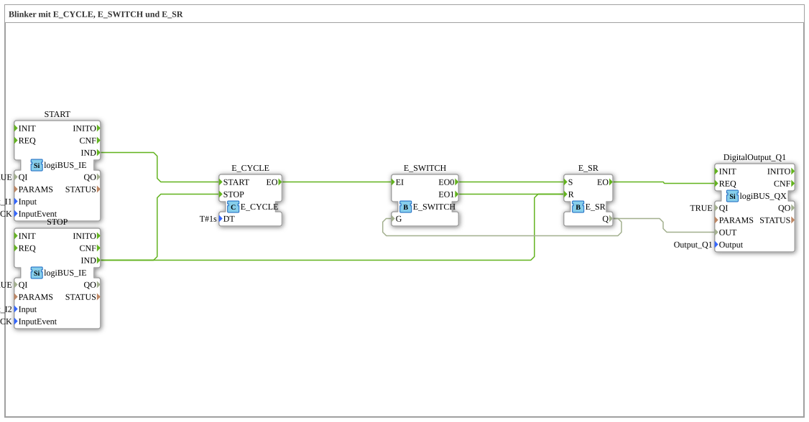

# Exercise_007a3: Flasher with E_CYCLE, E_SWITCH, and E_SR
[](https://notebooklm.google.com/notebook/a6872e59-1dfc-4132-a118-aff1bc7bc944)
This article describes the logiBUS® exercise `Uebung_007a3`. It presents the "clean" solution for a switchable flasher that is guaranteed to enter the "OFF" state when switched off.
----
## Objective of the Exercise
Implementation of a flasher with defined stop behavior. It demonstrates how event paths must be linked to both stop clock generation and clear the state memory.

-----

## Description and Components

[cite_start]In `Uebung_007a3.SUB`, the flasher logic is manually constructed from a switch and memory to ensure full control over the reset process.[cite: 1]

### Function Blocks (FBs)



* **`E_CYCLE`**: The clock generator.
* **`E_SWITCH`**: The event switch for implementing the toggle function.
* **`E_SR`**: The memory block (reset-dominant).
* **`START` & `STOP`**: The operating buttons.

-----

## Functionality

Safety is achieved through a dual assignment of the stop signal:

```xml
<EventConnections>
<Connection Source="START.IND" Destination="E_CYCLE.START"/>
<Connection Source="STOP.IND" Destination="E_CYCLE.STOP"/>
<Connection Source="E_CYCLE.EO" Destination="E_SWITCH.EI"/>
<Connection Source="E_SWITCH.EO0" Destination="E_SR.S"/>
<Connection Source="E_SWITCH.EO1" Destination="E_SR.R"/>
<!-- Die entscheidende Verbindung für die Sicherheit: -->
<Connection Source="STOP.IND" Destination="E_SR.R"/>
</EventConnections>

[cite_start][cite: 1]

1. **Blinking Operation**: The `E_CYCLE` triggers the `E_SWITCH/E_SR` combination, resulting in periodic switching.

2. **Shutdown**: When the user presses `STOP`, two things happen simultaneously:

* The `E_CYCLE` is stopped (no more clock cycles).
* The memory `E_SR` receives a **direct reset command**. This immediately forces the output to `FALSE`, regardless of whether the flip-flop was in the "on" or "off" state.

-----

## Application Example

**Professional Warning Signaling**:

An audible alarm or a flashing light on a machine must stop immediately and reliably upon acknowledgment. A "stuck" state while switched on would be misleading and disruptive. This circuit guarantees that the alarm is always inactive after being switched off.