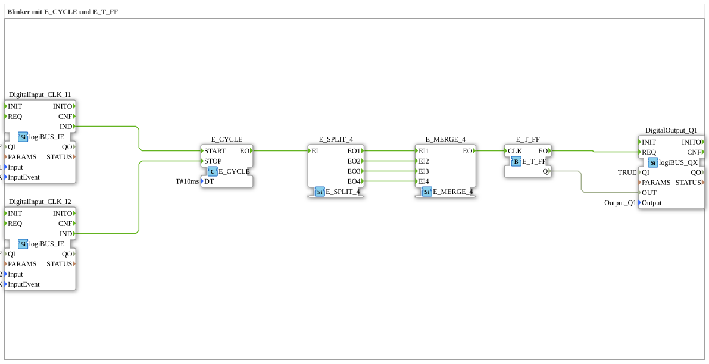

# Exercise_007b: Flasher with E_CYCLE and E_T_FF

* * * * * * * * * *
## Introduction
This exercise implements a simple flasher controlled by two pushbuttons. An E_CYCLE function block generates periodic events, which are distributed to multiple paths via an E_SPLIT_4. All four outputs of the splitter are merged in an E_MERGE_4, so that each period sends a single event to the toggle flip-flop (E_T_FF). The flip-flop's output switches a digital output (logiBUS Q1). The clock generator can be started via one pushbutton (I1) and stopped via a second pushbutton (I2).
All logic is encapsulated in a sub-application and uses only logiBUS hardware inputs and outputs.

---

## Function Blocks (FBs) Used

The subapplication consists of the following function blocks:

### Block: `DigitalOutput_Q1`
- **Type**: `logiBUS::io::DQ::logiBUS_QX`
- **Parameters**:
- `QI` = `TRUE` (Enable)
- `Output` = `Output_Q1` (Hardware Output)
- **Event Inputs**: `REQ` (Switches the output)
- **Data Inputs**: `OUT` (Value for the output, 0 or 1)
- **Functionality**: Sets the logiBUS digital output Q1 to the value of the Data is received as soon as an event arrives at `REQ`.

### Block: `E_CYCLE`
- **Type**: `iec61499::events::E_CYCLE`
- **Parameters**:
- `DT` = `T#10ms` (cycle time 10 ms)
- **Event Inputs**:
- `START` (starts cyclic generation)
- `STOP` (stops cyclic generation)
- **Event Outputs**:
- `EO` (outputs an event every `DT`)
- **Functionality**: Generates events periodically at 10 ms intervals after starting. The counter can be stopped by an event at `STOP`.

### Component: `E_T_FF`
- **Type**: `iec61499::events::E_T_FF`
- **Parameters**: None
- **Event Inputs**:
- `CLK` (Clock – each event toggles the output)
- **Event Outputs**:
- `EO` (output on each clock cycle)
- **Data Outputs**:
- `Q` (current value of the flip-flop, 0 or 1)
- **Functionality**: A toggle flip-flop: with each event at `CLK`, the output `Q` toggles between 0 and 1. Simultaneously, an event at `EO` Triggered.

--

### Block: `E_SPLIT_4`
- **Type**: `iec61499::events::E_SPLIT_4`
- **Parameters**: None
- **Event Inputs**: `EI` (Input Event)
- **Event Outputs**: `EO1`, `EO2`, `EO3`, `EO4` (four parallel outputs)
- **Functionality**: Distributes an incoming event to all four outputs simultaneously.

---

### Module: `E_MERGE_4`
- **Type**: `iec61499::events::E_MERGE_4`
- **Parameters**: None
- **Event Inputs**: `EI1`, `EI2`, `EI3`, `EI4` (four inputs)
- **Event Outputs**: `EO` (output event)
- **Functionality**: As soon as an event arrives at one of the four inputs, it is immediately passed on to the output. (Logical OR operation of events.)

---

### Module: `DigitalInput_CLK_I1`
- **Type**: `logiBUS::io::DI::logiBUS_IE`
- **Parameters**:
- `QI` = `TRUE`
- `Input` = `Input_I1` (Hardware input I1)
- `InputEvent` = `BUTTON_SINGLE_CLICK` (Event triggered by a single key press)
- **Event Outputs**: `IND` (Triggered upon detected event)
- **Functionality**: Detects a single key press at input I1 and outputs an event `IND`.

---

### Block: `DigitalInput_CLK_I2`
- **Type**: `logiBUS::io::DI::logiBUS_IE`
- **Parameters**:
- `QI` = `TRUE`
- `Input` = `Input_I2` (Hardware input I2)
- `InputEvent` = `BUTTON_SINGLE_CLICK`
- **Event outputs**: `IND`
- **Functionality**: As above, but for the second button on input I2.

---

## Program Flow and Connections

The following description explains the signal flow within the subapplication.

1. **Start/Stop of the Clock Generator**

- Pressing a key at I1 triggers an event at the output `IND` of `DigitalInput_CLK_I1`. This event is connected to the event input `START` of `E_CYCLE` → the cycle generator starts.
- Pressing a key at I2 triggers an event at the output `IND` of `DigitalInput_CLK_I2`. This event is connected to the event input `STOP` of `E_CYCLE` → the cycle generator stops.

`` 2. **Cycle and Distribution**

- The `E_CYCLE` generates an event at its output `EO` every 10 ms.
- This event is fed to the input `EI` of the `E_SPLIT_4`. The splitter distributes the event to all four outputs (`EO1` to `EO4`).

3. **Combination**

- The four outputs of the splitter are connected to the four inputs (`EI1` to `EI4`) of the `E_MERGE_4`. This ensures that every event, regardless of the path it takes, is immediately forwarded to the output `EO` of the merger.
- The connection from the splitter to the merger via all four paths serves here purely as passthrough (redundancy), but could be used for future expansions.

4. **Toggle Flip-Flop**

- The output event of `E_MERGE_4` is fed to the clock input `CLK` of `E_T_FF`.
- With each clock cycle, the output `Q` of the flip-flop toggles its state (0 → 1 → 0 → …).
- Simultaneously, an event is triggered at the output `EO` of the flip-flop.

` This means that every event, regardless of the path it takes, is immediately forwarded to the output `EO` of the flip-flop.

`` This means that 4.

`` ` ... 5. **Output**

- The flip-flop's event `EO` is connected to the event input `REQ` of the output block `DigitalOutput_Q1`.
- The flip-flop's current value `Q` is assigned to the output block's data input `OUT`.
- At each clock cycle, output Q1 is set to the current flip-flop state – this produces a blinking signal with a period of 20 ms (10 ms on, 10 ms off if the cycle time is 10 ms).
...
### Data Connections

- `E_T_FF.Q` → `DigitalOutput_Q1.OUT`

Transfers the toggling value (0/1) to the output block.

### Event Connections (Summary)

| Source | Destination |

|---------------------------|---------------------------|

| `DigitalInput_CLK_I1.IND` | `E_CYCLE.START` |

| `DigitalInput_CLK_I2.IND` | `E_CYCLE.STOP` |

| `E_CYCLE.EO` | `E_SPLIT_4.EI` |

| `E_SPLIT_4.EO1` | `E_MERGE_4.EI1` |
| `E_SPLIT_4.EO2` | `E_MERGE_4.EI2` |
| `E_SPLIT_4.EO3` | `E_MERGE_4.EI3` |
| `E_SPLIT_4.EO4` | `E_MERGE_4.EI4` |
| `E_MERGE_4.EO` | `E_T_FF.CLK` |

| `E_T_FF.EO` | `DigitalOutput_Q1.REQ` |

--

## Summary

Exercise 007b demonstrates the use of cyclic event generation (`E_CYCLE`), event distribution and merging (`E_SPLIT_4`, `E_MERGE_4`), and a toggle flip-flop (`E_T_FF`) to generate a flashing signal. Control is achieved via two logiBUS pushbuttons (start/stop). The setup is implemented as a reusable sub-application and can be directly imported into a 4diac IDE environment. The circuit is a basic example of time-controlled outputs with simple user interaction.

---

### 🌐 Related topic subpages on ms-muc-docs.de
* [🌐 Eclipse 4diac IDE & Color Reference on ms-muc-docs.de](https://www.ms-muc-docs.de/iec-61499/eclipse-4diac/)

]
