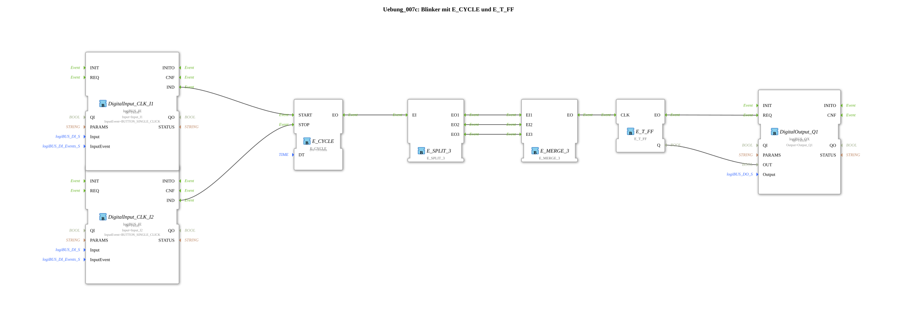

# Exercise_007c: Flasher with E_CYCLE and E_T_FF

* * * * * * * * * *
## Introduction
This exercise demonstrates the creation of a simple flasher using the IEC 61499 function blocks `E_CYCLE` and `E_T_FF`.
The flasher is controlled via two digital inputs:

- **Input I1** (single-click push button) starts the flashing function.
- **Input I2** (single-click push button) stops it.

The output **Q1** toggles periodically between on and off every 10 ms as long as the flashing function is active.

This exercise teaches how to work with cyclic events, event splitting/merging, and the toggle function.

## Function Blocks (FBs) Used

| Block Name | Type | Parameters | Description |
|-----------------------|-------------------------------|---------------------------------------------|--------------|
| `E_CYCLE` | `iec61499::events::E_CYCLE` | `DT = T#10ms` | Generates an event at its output `EO` every 10 ms. |
| `E_SPLIT_3` | `iec61499::events::E_SPLIT_3` | – | Distributes an incoming event to three identical outputs (`EO1`, `EO2`, `EO3`). |
| `E_MERGE_3` | `iec61499::events::E_MERGE_3` | – | Combines three incoming events (`EI1`, `EI2`, `EI3`) into a single output `EO`. |
| `E_T_FF` | `iec61499::events::E_T_FF` | – | Toggle flip-flop: On each event at input `CLK`, output `Q` toggles its value (0→1 or 1→0). |
| `DigitalInput_CLK_I1` | `logiBUS::io::DI::logiBUS_IE` | `QI = TRUE`, `Input = Input_I1`, `InputEvent = BUTTON_SINGLE_CLICK` | Converts a key press at I1 into an event at output `IND` (start command). |
| `DigitalInput_CLK_I2` | `logiBUS::io::DI::logiBUS_IE` | `QI = TRUE`, `Input = Input_I2`, `InputEvent = BUTTON_SINGLE_CLICK` | Converts a key press at I2 into an event at output `IND` (stop command). |
| `DigitalOutput_Q1` | `logiBUS::io::DQ::logiBUS_QX` | `QI = TRUE`, `Output = Output_Q1` | Controls digital output Q1. An event at input `REQ` takes the data value at input `OUT` and outputs it physically. |

## Program Flow and Connections

1. **Start**: Pressing a key on **I1** generates an event on `DigitalInput_CLK_I1.IND`. This event is connected to the **START** input of `E_CYCLE` and activates the cyclic timer.

2. **Stop**: Pressing a key on **I2** generates an event on `DigitalInput_CLK_I2.IND`. This event is connected to the **STOP** input of `E_CYCLE` and deactivates the timer.

3. **Cycle**: As long as `E_CYCLE` is active, it generates an event every 10 ms at its output `EO`.

4. **Splitting**: This event is split across three outputs (`E_SPLIT_3`–`EO1`–`EO3`) by `E_SPLIT_3`.

5. **Merging**: The three identical events are merged back into a single event via `E_MERGE_3`. (This minimizes the delay time and ensures signal integrity.)

6. **Toggle**: The merged event triggers the `CLK` input of `E_T_FF`. The flip-flop's state toggles with each clock cycle. The current value is provided at the data output `Q`.

7. **Output**: The event `EO` from `E_T_FF` is routed to the `REQ` input of `DigitalOutput_Q1`. Simultaneously, the data value `Q` (0 or 1) is passed to the `OUT` input of the output module. Output Q1 is set accordingly at each clock cycle.

`` **Learning Objectives**:

- Understanding cyclic events (`E_CYCLE`)
- Using a toggle flip-flop (`E_T_FF`)
- Event multiplication and merging (`E_SPLIT_3`, `E_MERGE_3`)
- Switching a function on and off via digital inputs

**Difficulty Level**: Beginner
**Prerequisites**: Basic knowledge of the IEC 61499 event chain, simple connections between function blocks

**Preliminary Notes**:

- This exercise uses the logiBUS hardware interface – ensure that inputs I1 and I2 and output Q1 are correctly connected.
- The pushbuttons must be configured in **single-click** mode.
- After activating E_CYCLE (Start), Q1 flashes until the Stop button is pressed.

## Summary

Exercise `Uebung_007c` implements a switchable flasher based on `E_CYCLE` and `E_T_FF`. It demonstrates how system-timed events are combined with a toggle flip-flop to generate a changing output. The use of `E_SPLIT_3` and `E_MERGE_3` illustrates the handling of event branching. The two buttons allow the user to selectively start and stop a cyclic function.
