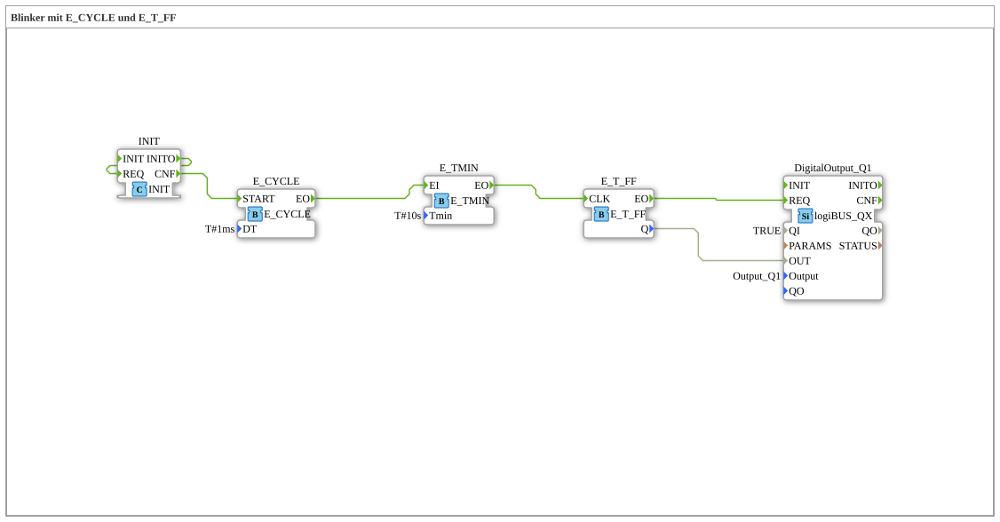

# Exercise_007d: Blinker with E_CYCLE and E_T_FF

* * * * * * * * * *
## Introduction

This exercise demonstrates the implementation of a blinker using the function blocks `E_CYCLE` and `E_T_FF`. The blinker switches a digital output on and off at a fixed time interval. A periodic event is generated by `E_CYCLE`, extended to a specific minimum duration by `E_TMIN`, and then toggled by a T-flip-flop (`E_T_FF`). The result is output to a digital output.

## Function Blocks Used (FBs)

- **`E_CYCLE`** (Type: `iec61499::events::E_CYCLE`)

Cyclically generates an event at output `EO`.

- Parameter: `DT` = `T#1ms` (Cycle time 1 millisecond)
- **`E_TMIN`** (Type: `iec61499::events::E_TMIN`)

Outputs an event at output `EO` if at least `Tmin` of time has elapsed since the last input event.

- Parameter: `Tmin` = `T#10s`
- **`E_T_FF`** (Type: `iec61499::events::E_T_FF`)

A T-flip-flop with clock input `CLK`. On each event at `CLK`, the data output `Q` toggles its state (0→1, 1→0). The event output `EO` is activated simultaneously with the `CLK` event.

- **`DigitalOutput_Q1`** (Type: `logiBUS::io::DQ::logiBUS_QX`)

Digital output module that passes the value of input `OUT` to physical output `Output_Q1`.

- Parameters: `QI` = `TRUE` (Activation), `Output` = `Output_Q1` (Hardware Address)
- Event input `REQ`: Data value is received

## Program Flow and Connections

The exercise flow is determined by the event and data connections in the network:

1. **Event Generation**:

E_CYCLE` sends an event every 1 ms to the input `EI` of `E_TMIN`.

2. **Time Delay**:

E_TMIN` waits until at least 10 seconds have passed since its last event. Only then does it itself output an event at its output `EO`. This "slows down" the original 1 ms event to a period of 10 seconds.

3. **Toggle Flip-Flop**:

The delayed event from `E_TMIN.EO` is fed to the clock input `CLK` of `E_T_FF`. Each clock cycle toggles the data output `Q` of the flip-flop. Simultaneously, `E_T_FF` generates an event at `EO`.

4. **Output**:
- The data value `E_T_FF.Q` is forwarded via a data connection to the data input `OUT` from `DigitalOutput_Q1`.
- The event `E_T_FF.EO` triggers the `REQ` input of the digital output, so that the current value from `OUT` is taken and set at the physical output.

**Result**:

The digital output switches on every 10 seconds: 10 seconds on, 10 seconds off (blink frequency 0.05 Hz).

This exercise teaches the basics of event-driven timing control in 4diac. It demonstrates how a slower clock signal can be generated from a fast cycle using `E_TMIN` and converted into a square wave signal using a T flip-flop.

## Summary

Exercise **Exercise_007d** implements a simple blinker using the function blocks `E_CYCLE`, `E_TMIN`, and `E_T_FF`. Cascading these event blocks enables flexible timing control without relying on conventional timers or counters. The resulting sub-application type can be directly integrated into higher-level projects to, for example, control signal lamps or optical displays according to a timer.

---

### 🌐 Related topic subpages on ms-muc-docs.de

- [🌐 Eclipse 4diac IDE & Color Reference on ms-muc-docs.de](https://www.ms-muc-docs.de/iec-61499/eclipse-4diac/)

]
