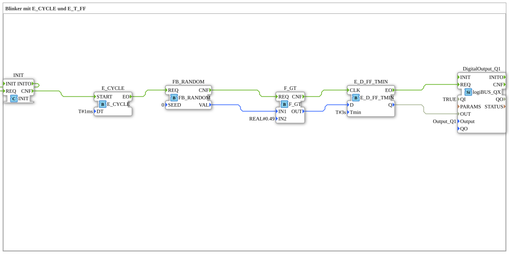

# Exercise_007d2: Blinker with E_CYCLE and E_T_FF

* * * * * * * * * *

## Introduction

This exercise implements a blinker using `E_CYCLE` and `E_D_FF_TMIN`. The blinker generates a random on/off cycle, and a flip-flop with a minimum on-time of 3 seconds ensures that the output does not turn off too soon after being switched on.

## Function Blocks (FBs) Used

- **E_CYCLE**

*Type*: `iec61499::events::E_CYCLE`

*Parameter*: `DT` = `T#1ms` (Cycle time 1 ms)

A cyclic event generator that periodically triggers an event.

- **FB_RANDOM**

*Type*: `eclipse4diac::utils::FB_RANDOM`

*Parameter*: `SEED` = `0` (Start value for random number)

Generates a random value in the range 0..1.

- **F_GT**

*Type*: `iec61131::comparison::F_GT`

*Parameter*: `IN2` = `REAL#0.49` (fixed comparison value)

Compares the values `IN1 > IN2` and returns a Boolean output.

- **E_D_FF_TMIN**

*Type*: `iec61499::events::E_D_FF_TMIN`

*Parameter*: `Tmin` = `T#3s` (minimum turn-on time)

A D flip-flop that takes over the data input after a rising clock signal and holds the output TRUE for at least `Tmin`.

- **DigitalOutput_Q1**

*Type*: `logiBUS::io::DQ::logiBUS_QX`

*Parameters*: `QI` = `TRUE` (output activation), `Output` = `Output_Q1` (physical output)

Digital output on the logiBUS system.

## Program Flow and Connections

The flow is started by the cyclic event generator `E_CYCLE` (every 1 ms). The event `EO` triggers the function block `FB_RANDOM` (`REQ`), which generates a random floating-point value (`VAL`). This value is passed to the data input `IN1` from `F_GT`. The comparison function block compares the random value with the fixed threshold `0.49` and generates a Boolean result (`OUT`). The result `TRUE` corresponds to a random number > 0.49, and `FALSE` corresponds to ≤ 0.49.

... The event `CNF` from `FB_RANDOM` triggers `F_GT` (`REQ`). After the calculation, `F_GT` sends a `CNF` to the clock input `CLK` of `E_D_FF_TMIN`. Simultaneously, the flip-flop adopts the current value of `D` (corresponding to `F_GT.OUT`). The flip-flop's output `Q` remains at `TRUE` for at least 3 seconds after power-on, even if `D` switches back to `FALSE` before this time elapses. The output `Q` controls the data input `OUT` of `DigitalOutput_Q1`. The flip-flop's event `EO` triggers the output (`REQ`), causing the physical output to apply the current value.

... **Event and Data Connections:**

- `E_CYCLE.EO` → `FB_RANDOM.REQ`
- `FB_RANDOM.CNF` → `F_GT.REQ`
- `FB_RANDOM.VAL` → `F_GT.IN1`
- `F_GT.CNF` → `E_D_FF_TMIN.CLK`
- `F_GT.OUT` → `E_D_FF_TMIN.D`
- `E_D_FF_TMIN.EO` → `DigitalOutput_Q1.REQ`
- `E_D_FF_TMIN.Q` → `DigitalOutput_Q1.OUT`

## Summary

This exercise demonstrates the combination of a cyclic event generator, a random number generator, a comparison block, a flip-flop with minimal on-time, and a digital output. Learning objectives include:

- Understanding event and data flows in IEC 61499.
- Parameterizing timing blocks (`E_CYCLE`, `E_D_FF_TMIN`).
- Creating a blink pattern with a variable duty cycle using a random process.
- Integrating a logiBUS output.

Basic knowledge of event handling according to IEC 61499 and logiBUS output control is required.

---

### 🌐 Related topic subpages on ms-muc-docs.de

- [🌐 Eclipse 4diac IDE & Color Reference on ms-muc-docs.de](https://www.ms-muc-docs.de/iec-61499/eclipse-4diac/)

]
