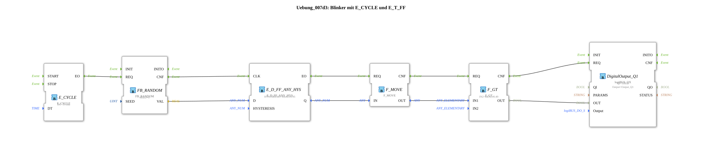

# Exercise_007d3: Flasher with E_CYCLE and E_T_FF

* * * * * * * * * *
## Introduction
This exercise implements a randomly controlled flasher using the function blocks `E_CYCLE`, `FB_RANDOM`, `E_D_FF_ANY_HYS`, `F_MOVE`, and `F_GT`. A cyclic clock triggers the generation of a random value, which, via a flip-flop with hysteresis and a comparator, switches a digital output. The flasher thus simulates an irregular on/off behavior.
## Function Blocks Used

| Block Name | Type | Parameters | Short Description |

|--------------|-----|-----------|------------------|

| `E_CYCLE` | `iec61499::events::E_CYCLE` | DT = T#1ms | Generates an event every 1 ms at output `EO`. |

| `FB_RANDOM` | `eclipse4diac::utils::FB_RANDOM` | SEED = 0 | Returns a new REAL random value between 0 and 1 at output `VAL` for each `REQ` event. |

| `E_D_FF_ANY_HYS` | `logiBUS::signalprocessing::hysteresis::E_D_FF_ANY_HYS` | HYSTERESIS = REAL#0.95 | Clocked flip-flop with hysteresis: The input `D` is taken over by the event at `CLK`. The output `Q` only switches when the value exceeds the hysteresis. |

| `F_MOVE` | `iec61131::selection::F_MOVE` | DataType = REAL | Copies the input value (`IN`) unchanged to the output (`OUT`). Used here for type conversion from BOOL to REAL. |

| `F_GT` | `iec61131::comparison::F_GT` | IN2 = REAL#0.49 | Compares `IN1` with the constant `IN2` and outputs TRUE at `OUT` if `IN1` is greater than 0.49. |

| `DigitalOutput_Q1` | `logiBUS::io::DQ::logiBUS_QX` | QI = TRUE, Output = Output_Q1 | Digital output module that forwards the passed signal (`OUT`) to the physical address `Output_Q1`. |

## Program Flow and Connections

1. **Clock Generation**

`E_CYCLE` generates an event at its output `EO` every 1 ms.

2. **Generate a Random Value**

This event is passed via the event connection to the input `REQ` of `FB_RANDOM`. `FB_RANDOM` calculates a random REAL value between 0 and 1 and outputs it at the data output `VAL`. Simultaneously, it signals completion via `CNF`.

3. **Flip-Flop with Hysteresis**

The `CNF` event triggers the clock input `CLK` of `E_D_FF_ANY_HYS`. The data value of `FB_RANDOM.VAL` is applied to the data input `D`. Due to the set hysteresis of 0.95, the output `Q` is only set to TRUE if the random value significantly exceeds the previous threshold; if it falls below the threshold, it is reset after a corresponding delay. The output `Q` is a BOOL value.

``` 4. **Type Conversion**

After the flip-flop, the BOOL value is converted to a REAL number (TRUE → 1.0, FALSE → 0.0) via `F_MOVE` (with DataType = REAL). The event for this conversion is provided by `E_D_FF_ANY_HYS.EO`.

5. **Comparison with Threshold**

The converted value is sent via the data connection to input `IN1` of `F_GT`. This input compares it to the constant `IN2 = 0.49`. If `IN1` is greater, output `OUT` is set to TRUE; otherwise, it is set to FALSE.

6. **Output to Digital Output**

The result of the comparison (`F_GT.OUT`) is both fed as a data value to the input `OUT` of the digital output module `DigitalOutput_Q1` and triggered via the event connection (`F_GT.CNF → DigitalOutput_Q1.REQ`). `DigitalOutput_Q1` then outputs the value to the physical line `Output_Q1`.

The entire process repeats with each clock cycle of `E_CYCLE` (every 1 ms), resulting in an irregular flashing signal at the output. This signal is delayed by hysteresis and further shaped by the threshold value.

## Summary

This exercise demonstrates the combination of cyclic event control, random value generation, a flip-flop with hysteresis, type conversion, and comparison logic to generate a dynamic output signal. Learning objectives include understanding event-data connections, parameterizing timing and hysteresis blocks, and interconnecting multiple function blocks into a functional unit. Basic knowledge of IEC 61499 and the 4diac IDE is required.

---

### 🌐 Related topic subpages on ms-muc-docs.de
* [🌐 Eclipse 4diac IDE & color reference on ms-muc-docs.de](https://www.ms-muc-docs.de/iec-61499/eclipse-4diac/)

]