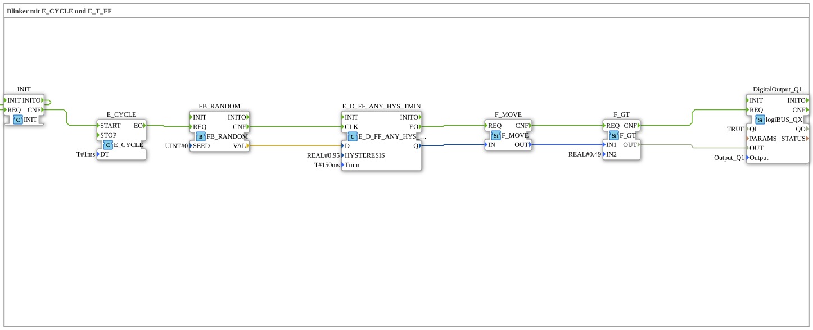

# Exercise_007d4: Blinker with E_CYCLE and E_T_FF

* * * * * * * * * *
## Introduction

This exercise implements a **blinker** based on a random signal.
A periodic clock (E_CYCLE) triggers a random number generator (FB_RANDOM).

Its output is filtered by a hysteresis flip-flop (E_D_FF_ANY_HYS),

then processed by a Move function block and compared to a threshold value (F_GT).

The result switches a digital output (logiBUS QX) – producing an irregularly blinking signal.

## Function Blocks Used (FBs)

- **DigitalOutput_Q1** (Type: `logiBUS::io::DQ::logiBUS_QX`)
- Parameters: `QI` = TRUE, `Output` = "Output_Q1"
- Purpose: Physical digital output (simulated here).
- **E_CYCLE** (Type: `iec61499::events::E_CYCLE`)
- Parameter: `DT` = T#1ms
- Purpose: Generates a periodic event pulse (clock).
- **FB_RANDOM** (Type: `eclipse4diac::utils::FB_RANDOM`)
- Parameter: `SEED` = 0
- Purpose: Generates a new random value (REAL) at output VAL with each REQ.

**F_GT** (Type: `iec61131::comparison::F_GT`)

- Parameter: `IN2` = REAL#0.49
- Purpose: Compares two REAL values; OUT is TRUE if IN1 > IN2.
- **E_D_FF_ANY_HYS** (Type: `logiBUS::signalprocessing::hysteresis::E_D_FF_ANY_HYS_TMIN`)
- Parameters: `HYSTERESIS` = REAL#0.95, `Tmin` = T#150ms
- Purpose: Hysteresis-based D flip-flop with minimum turn-on time; Q becomes TRUE if D > hysteresis and the last state was at least Tmin ago.
- **F_MOVE** (Type: `iec61131::selection::F_MOVE`)
- Attribute: `DataType` = REAL
- Purpose: Copies the value from IN to OUT (without delay).

## Program Flow and Connections

1. **Clock Generation**

E_CYCLE generates an event at its output `EO` every 1 ms.

This event is directly forwarded to the input `REQ` of FB_RANDOM.

2. **Generate Random Value**

FB_RANDOM delivers a new REAL random value to `VAL` every time `REQ` occurs.

This value is fed to the data input `D` of the hysteresis flip-flop.

3. **Hysteresis Filter**

E_D_FF_ANY_HYS compares the current value with the hysteresis threshold (0.95).

If the value exceeds the threshold **and** the minimum time Tmin has elapsed since the last switch,

the output `Q` is set to TRUE; otherwise, it is set to FALSE.

A valid switch generates an event at `EO`.

4. **Signal Propagation**
- The event `EO` from the hysteresis flip-flop triggers the F_MOVE block.
- F_MOVE copies the current state `Q` (as REAL: 0.0 or 1.0?) to its output `OUT`.
- The output `OUT` is passed to the data input `IN1` of the comparator block F_GT.
- The event `CNF` from F_MOVE starts F_GT.
5. **Threshold Comparison**

F_GT checks if the copied value is greater than 0.49.

- If the value is > 0.49 (i.e., the hysteresis output was TRUE), `OUT` becomes TRUE.
- If it is ≤ 0.49, `OUT` becomes FALSE.

The event `CNF` from F_GT triggers the digital output.

6. **Set Output**

The digital output `DigitalOutput_Q1` receives the comparison result via the data input `OUT`.

The output of the function block (e.g., an LED) lights up when the current random value exceeds the hysteresis and the comparison was successful.

**Summary of Signal Processing:**

E_CYCLE` → `FB_RANDOM` → `E_D_FF_ANY_HYS` → `F_MOVE` → `F_GT` → `DigitalOutput_Q1`

**Learning Objectives of this Exercise:**

- Understanding the interplay of event and data flows in 4diac.
- Using a cyclic clock (E_CYCLE) to control repeated calculations.
- Applying random number generators and hysteresis functions to generate an irregular signal.
- Practical use of comparison and output functions.

## Summary

Exercise "Exercise_007d4" demonstrates the construction of a **blinker with random on/off phases**.

A periodic clock triggers a chain of components: random number generator, hysteresis filter, value propagation, threshold comparison, and finally a digital output.

The combination of hysteresis and minimum time results in a blinking pattern that is not purely random but adheres to certain minimum on and off times.

This example deepens the understanding of event-driven function blocks, parameter configuration, and the coupling of data and event connections in the 4diac IDE.

---

### 🌐 Related topic subpages on ms-muc-docs.de

* [🌐 Eclipse 4diac IDE & Color Reference on ms-muc-docs.de](https://www.ms-muc-docs.de/iec-61499/eclipse-4diac/)
