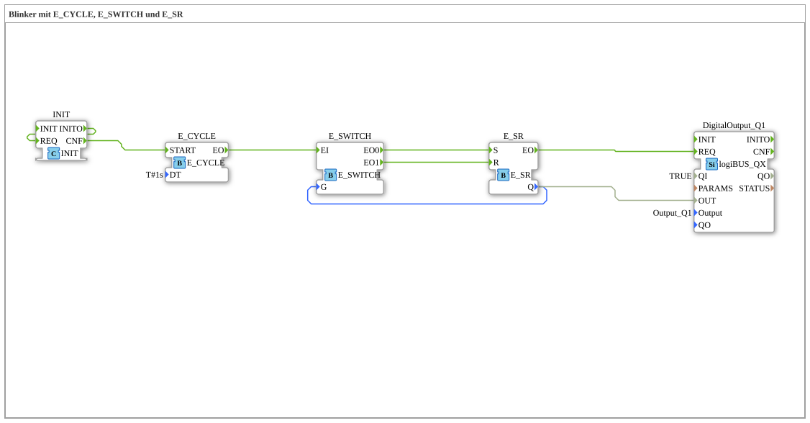

# Exercise_008: Blinker with E_CYCLE, E_SWITCH, and E_SR

This article describes the logiBUS® exercise `Uebung_008`. It demonstrates the logic of a continuously running clock generator with internal memory.
----
## Objective of the Exercise
Implementation of a self-contained blinker circuit.

-----

## Description and Components

[cite_start]The subapplication `Uebung_008.SUB` utilizes the combination of `E_CYCLE`, `E_SWITCH`, and `E_SR` without external control inputs[cite: 1].

The clock generator `E_CYCLE` runs continuously (after initialization by the system). The logic ensures that the output `Q1` toggles between `TRUE` and `FALSE` every second. Since there is no stop logic, this setup serves as the program's continuous heartbeat.

-----

## Application Example

**Status LED (Heartbeat)**:

An LED directly on the CPU board that blinks continuously as long as the power supply is present and the control program ("task") is executing without errors. If the LED stops blinking, the technician immediately knows that the controller has crashed or is stuck in a stopped state.