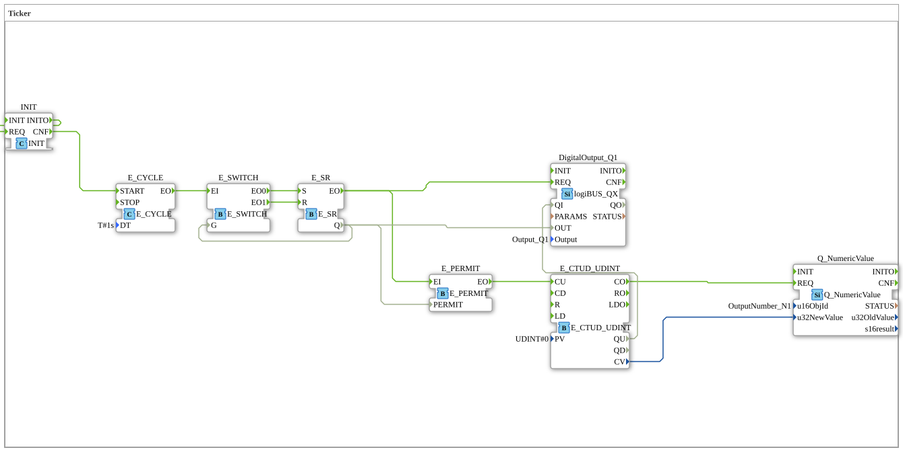

# Exercise_009: Ticker

This article describes the logiBUS® exercise `Uebung_009`. Here, we connect the time base with a counter function and a numeric display.
----
## Objective of the Exercise
To learn event-based counting (`E_CTUD`) and how to display values on a terminal.

-----

## Description and Components

[cite_start]In `Uebung_009.SUB`, a clock generator is used to control an up counter, the value of which is sent to an ISOBUS terminal[cite: 1].

### Function Blocks (FBs)

* **`E_CYCLE` & `E_SR`**: Generate a continuous clock signal (as in Exercise 008).
* **`E_PERMIT`**: An event gate. [cite_start]It only allows events at input `EI` to pass to output `EO` if the data input `PERMIT` is set to `TRUE`[cite: 1].
* **`E_CTUD_UDINT`**: A forward/downward counter for large integers.
* **`Q_NumericValue`**: An ISOBUS output module for displaying a number on the screen.

-----

## Functionality

1. The flasher module generates an event every second.

2. This event is filtered by `E_PERMIT`. Since `PERMIT` is connected to the flashing output, only **every second** event (i.e., only when the flasher is currently ON) is allowed through.

3. The allowed events reach the `CU` (Count Up) input of the counter.

4. The counter value increments.

5. With each change (`CO` - Count Output), the new value is sent to `Q_NumericValue`.

6. The user sees a steadily increasing number on the ISOBUS terminal.

-----

## Application Example

**Operating Hour Counter**:

The controller counts the time intervals during which a specific condition (e.g., "Engine running") is met. The total value is permanently stored and displayed to the operator as maintenance information on the terminal.

---

### 🌐 Related topic subpages on ms-muc-docs.de
* [🌐 E_CTU Event Counter module on ms-muc-docs.de](https://www.ms-muc-docs.de/iec-61499/event-function-blocks/e_ctu/)

]