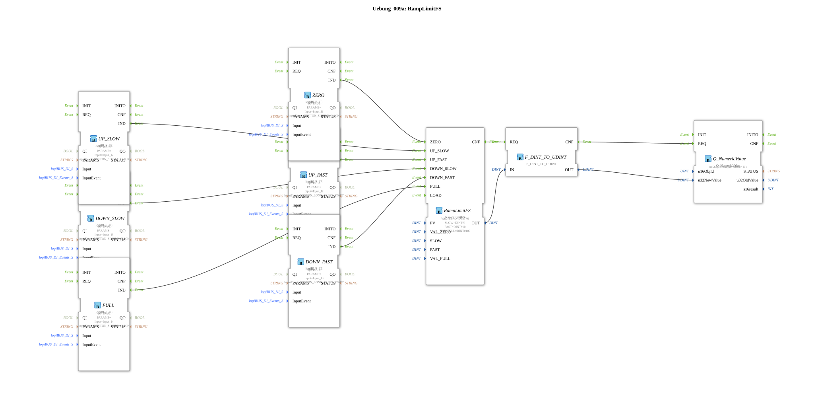

# Exercise_009a: RampLimitFS

This article describes the logiBUS® exercise `Uebung_009a`. It demonstrates the complex control of a numerical value using various button interactions.
----
## Objective of the Exercise

Control of a ramp function block (`RampLimitFS`). It shows how different event types (click vs. long press) can be used to influence the rate of value change.

-----

## Description and Components

[cite_start]The subapplication `Uebung_009a.SUB` uses a ramp function block for stepless control of a numerical value between 0 and 100[cite: 1].

### Function Blocks (FBs)

* **`RampLimitFS`**: The main function block from the signal processing library. It calculates an output value that changes gradually over time (ramp).
* **Input Button**:
* `ZERO`: Sets the value to 0 immediately.
* `FULL`: Sets the value to 100 immediately.
* `UP_SLOW` (Click): Increases the value slowly.
* `UP_FAST` (Long Press): Increases the value quickly.
* `DOWN_SLOW` (Click): Decreases the value slowly.
* `DOWN_FAST` (Long Press): Decreases the value rapidly.

-----

## Functionality

The Ramp block reacts to different event inputs:

1. **Static Targets**: Upon `ZERO` or `FULL`, the internal calculation immediately jumps to the limit values.
2. **Dynamic Change**:
* A click (`SINGLE_CLICK`) on `I2` triggers the `UP_SLOW` input of the Ramp block. The value increases at the rate specified in the parameter `SLOW`.
* If the user holds the button down for a longer period (`LONG_PRESS_START`), input `UP_FAST` is triggered. The value now increases significantly faster (parameter `FAST`).

The result is displayed as a number (`OutputNumber_N1`) on the ISOBUS terminal.

-----

## Application Example

**Electric Speed Control (Cruise Control)**:

With short presses of the joystick buttons, the driver can fine-tune the target speed in 1 km/h increments. If the button is held down, the vehicle accelerates quickly to the maximum speed. Pressing the button to "zero" immediately brakes the vehicle. The ramp ensures smooth transitions and protects the mechanics.