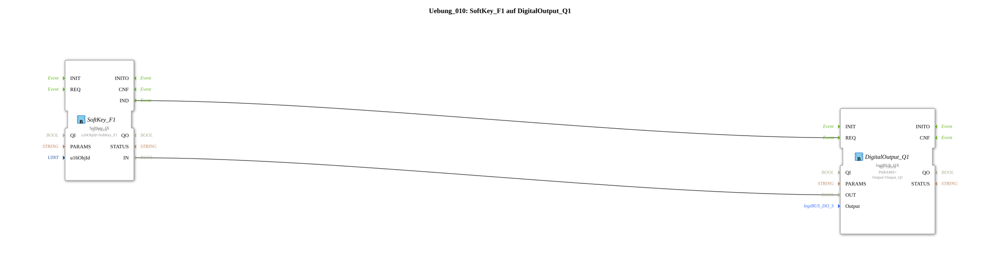

# Exercise_010: SoftKey_F1 on DigitalOutput_Q1

[(https://notebooklm.google.com/notebook/a6872e59-1dfc-4132-a118-aff1bc7bc944)
This article describes the logiBUS® exercise `Uebung_010`. It demonstrates how to connect virtual control elements of an ISOBUS terminal (Universal Terminal, UT) to physical outputs.

## 🎧 Podcast



- [The Chain Monster Awakens: Lanz Bulldog Caterpillar – The Fascinating Revival of the 10-Liter Hot-Bulk Workhorse After 25 Years of Inactivity](https://podcasters.spotify.com/pod/show/ms-muc-lama/episodes/Das-Kettenmonster-erwacht-Lanz-Bulldog-Raupe--Die-faszinierende-Wiederbelebung-des-10-Liter-Glhkopf-Arbeitstiers-nach-25-Jahren-Stillstand-e39arpd)
- [JBC Soldering Tips C470 vs. C245 vs. C210 vs. C115: Which Tip is the All-Rounder and When Do You Need the Nano Specialist?](https://podcasters.spotify.com/pod/show/ms-muc-lama/episodes/JBC-Ltspitzen-C470-vs--C245-vs--C210-vs--C115-Welche-Spitze-ist-der-Allrounder-und-wann-brauchst-du-den-Nano-Spezialisten-e39ak58)
- [AI Agents Revolutionize Embedded Development in 10 Steps](https://podcasters.spotify.com/pod/show/ms-muc-lama/episodes/KI-Agenten-revolutionieren-Embedded-Entwicklung-in-10-Stufen-e3dnv23)
- [Miniware TS101: The Mobile Soldering All-Rounder – Strengths, Weaknesses, and the USB-C Revolution](https://podcasters.spotify.com/pod/show/ms-muc-lama/episodes/Miniware-TS101-Das-mobile-Lt-Multitalent--Strken--Schwchen-und-die-USB-C-Revolution-e368lka)
- [Two Wi-Fi Networks Simultaneously in Windows 10: The Ingenious USB Stick Solution for IoT Devices Without Internet Interruption ](https://podcasters.spotify.com/pod/show/ms-muc-lama/episodes/Zwei-WLANs-gleichzeitig-in-Windows-10-Die-geniale-USB-Stick-Lsung-fr-IoT-Gerte-ohne-Internet-Unterbrechung-e375643)

----

## Exercise Objective

Using a `Softkey` function block to directly control a digital output. This exercise demonstrates how event and data connections are used to translate a touchscreen interaction into a physical action.

-----

## Description and Components

[cite_start]The subapplication `Uebung_010.SUB` connects a softkey instance to a standard output function block[cite: 1].

### Function Blocks (FBs)

- **`SoftKey_F1`**: Type `isobus::UT::io::Softkey::Softkey_IX`. This function block represents one of the buttons on the edge of the screen or on the touchscreen of the ISOBUS terminal.
- **`DigitalOutput_Q1`**: The physical output (e.g., a relay or a lamp).

### Parameters

- **`u16ObjId`**: This identifier refers to the corresponding object in the ISOBUS pool (here, `SoftKey_F1`).

-----

## Functionality

Communication is achieved via the standard separation of trigger and value:

```xml
<EventConnections>
<Connection Source="SoftKey_F1.IND" Destination="DigitalOutput_Q1.REQ"/>
</EventConnections>
<DataConnections>
<Connection Source="SoftKey_F1.IN" Destination="DigitalOutput_Q1.OUT"/>
</DataConnections>
```
## Application Example

**Manually Controlling a Hydraulic Valve**:

The driver selects a service page on their terminal. There, they will find a "Flush Valve" button. As long as this button is held down, the corresponding solenoid valve (`Q1`) will be activated.

---

### 🌐 Related topic subpages on ms-muc-docs.de

- [🌐 Interactive JBC soldering tip guide & infographic on ms-muc-docs.de](https://www.ms-muc-docs.de/elektrotechnik/werkzeug/lötkolben/jbc-lötspitzen-übersicht/)
