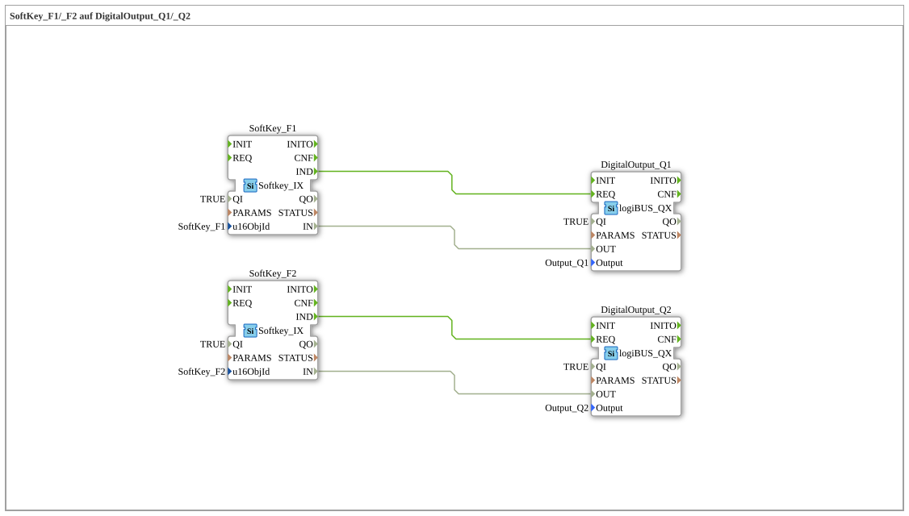

# Exercise_010a: SoftKey_F1/_F2 on DigitalOutput_Q1/_Q2

[(https://notebooklm.google.com/notebook/a6872e59-1dfc-4132-a118-aff1bc7bc944)
This article describes the logiBUS® exercise `Uebung_010a`.
## 🎧 Podcast

* [ISO 11783-6: Understanding Softkeys and the Virtual Terminal – Your Key to Agricultural Machinery Mechatronics ](https://podcasters.spotify.com/pod/show/isobus-vt-objects/episodes/ISO-11783-6-Softkeys-und-das-Virtual-Terminal-verstehen--Dein-Schlssel-zur-Landmaschinen-Mechatronik-e36a8b0)

----

## Goal of the Exercise

Extending ISOBUS control to multiple channels.

-----

## Description and Components

[cite_start]The subapplication `Uebung_010a.SUB` controls two independent hardware outputs via two softkeys on the terminal[cite: 1].

### Function Blocks (FBs)

* **`SoftKey_F1`** ➡️ **`DigitalOutput_Q1`**
* **`SoftKey_F2`** ➡️ **`DigitalOutput_Q2`**

Both signal paths use the event-based `IND -> REQ` connection.

-----

## Functionality

This demonstrates that the UT interface can be scaled as needed. Each softkey in the object pool can be used as an independent instance in the 4diac program to control specific actuators.

---

### 🌐 Related topic subpages on ms-muc-docs.de

* [🌐 Eclipse 4diac IDE & Color Reference on ms-muc-docs.de](https://www.ms-muc-docs.de/iec-61499/eclipse-4diac/)

]
