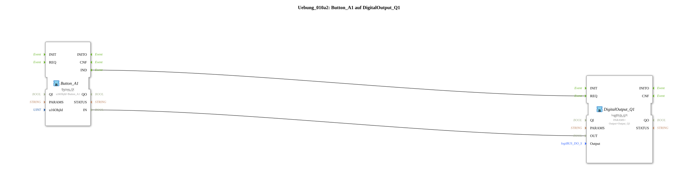

# Exercise_010a2: Button_A1 on DigitalOutput_Q1

This article describes the logiBUS® exercise `Uebung_010a2`. In addition to the softkeys on the side, ISOBUS also has "buttons" located directly within the workspace.
----
## Objective of the Exercise

Using a `Button_IX` function block.

-----

## Description and Components

[cite_start]The subapplication `Uebung_010a2.SUB` uses a button instead of a softkey to control an output[cite: 1].

### Function Blocks (FBs)

* **`Button_A1`**: Type `isobus::UT::io::Button::Button_IX`. References the object `Button_A1` in the pool.

-----

## Functionality

The logic is identical to the softkey: As long as the button on the screen is touched, the function block returns `TRUE`. The main difference is the visual placement and customization options within the terminal's graphical user interface.