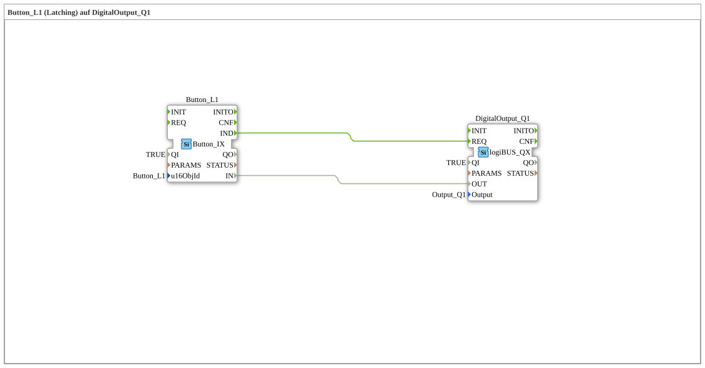

# Exercise_010a3: Button_L1 (Latching) on DigitalOutput_Q1

[(https://notebooklm.google.com/notebook/a6872e59-1dfc-4132-a118-aff1bc7bc944)
This article describes the logiBUS® exercise `Uebung_010a3`.
----
## Objective of the Exercise

Working with stateful control elements of the Universal Terminal.

-----

## Description and Components

[cite_start]In `Uebung_010a3.SUB`, a `Button_L1` (Latching) is used[cite: 1].

-----

## Functionality

A "Latching Button" is defined in the ISOBUS object pool such that it stores its state when pressed.

* First click: Button visually locks, continuously sends `TRUE`.
* Second click: Button retracts, continuously sends `FALSE`.

Therefore, as noted in the comment, **no software flip-flop** (T_FF) is required in 4diac. The memory function is handled entirely by the ISOBUS terminal.

---

### 🌐 Related topic subpages on ms-muc-docs.de

* [🌐 Eclipse 4diac IDE & Color Reference on ms-muc-docs.de](https://www.ms-muc-docs.de/iec-61499/eclipse-4diac/)

]