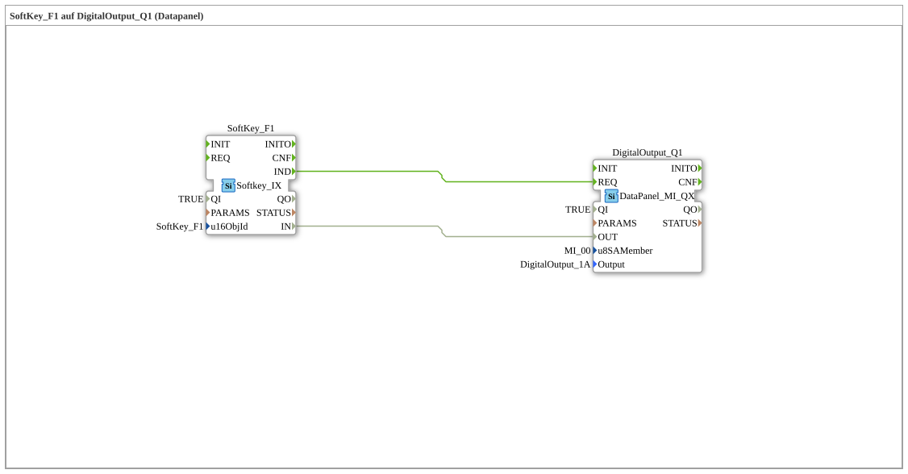

# Exercise_010a4: SoftKey_F1 on DigitalOutput_Q1 (Datapanel)

[(https://notebooklm.google.com/notebook/a6872e59-1dfc-4132-a118-aff1bc7bc944)
This article describes the logiBUS® exercise `Uebung_010a4`.
## 🎧 Podcast

- [ISO 11783-6: Understanding Softkeys and the Virtual Terminal – Your Key to Agricultural Machinery Mechatronics ](https://podcasters.spotify.com/pod/show/isobus-vt-objects/episodes/ISO-11783-6-Softkeys-und-das-Virtual-Terminal-verstehen--Dein-Schlssel-zur-Landmaschinen-Mechatronik-e36a8b0)

----

## Goal of the Exercise

Combining different logiBUS subsystems.

-----

## Description and Components

[cite_start]The subapplication `Uebung_010a4.SUB` connects an ISOBUS softkey to a physical output of a DataPanel[cite: 1].

### Function Blocks (FBs)

- **`SoftKey_F1`**: Input source from the tractor terminal.
- **`DigitalOutput_Q1`**: Type `DataPanel_MI_QX`. This is an output on a distributed I/O box on the CAN bus.

-----

## Functionality

This exercise illustrates the power of the IEC 61499 abstraction: For the program logic, it is completely irrelevant where a signal comes from (software terminal) or where it goes (CAN module). The event and data connections seamlessly bridge the protocol boundaries between ISOBUS and the device-specific CAN protocol.
