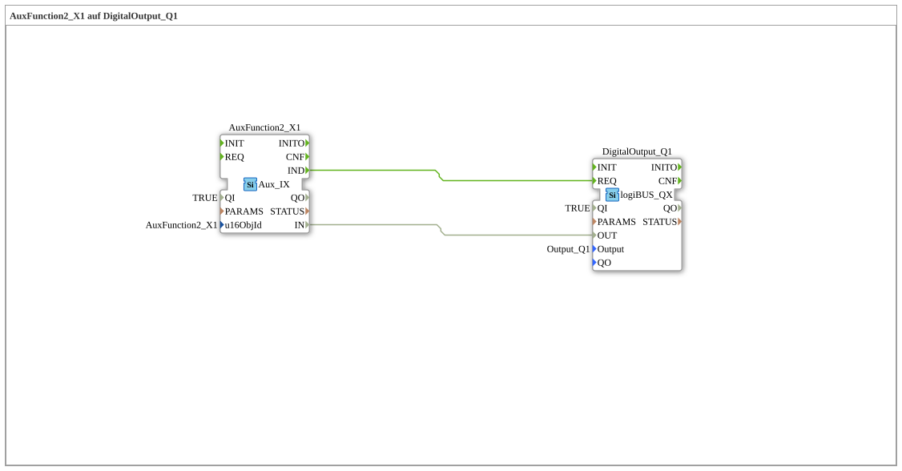

# Exercise_010b1: AuxFunction2_X1 on DigitalOutput_Q1

[(https://notebooklm.google.com/notebook/a6872e59-1dfc-4132-a118-aff1bc7bc944)
This article describes the logiBUS® exercise `Uebung_010b1`. It introduces the third pillar of ISOBUS operation: Auxiliary Functions (AUX-N)
----

## Objective of the Exercise

Connecting AUX input devices (e.g., ISOBUS joystick).

-----

## Description and Components

[cite_start]In `Uebung_010b1.SUB`, an Auxiliary Function is used to switch an output.[cite: 1]

### Function Blocks (FBs)

- **`AuxFunction2_X1`**: Type `isobus::UT::io::Auxiliary::IN::Aux_IX`. This block listens for AUX messages from "Function 2".

-----

## Functionality

Unlike softkeys, which are fixed screen elements, an AUX function is a logical object. The operator must specify once at the terminal (via the AUX menu) which physical button on their joystick they want to assign to this "Function 2". Once this "teaching" is complete, every press of the joystick button triggers the block in 4diac.

---

### 🌐 Related topic subpages on ms-muc-docs.de

- [🌐 Eclipse 4diac IDE & Color Reference on ms-muc-docs.de](https://www.ms-muc-docs.de/iec-61499/eclipse-4diac/)

]
