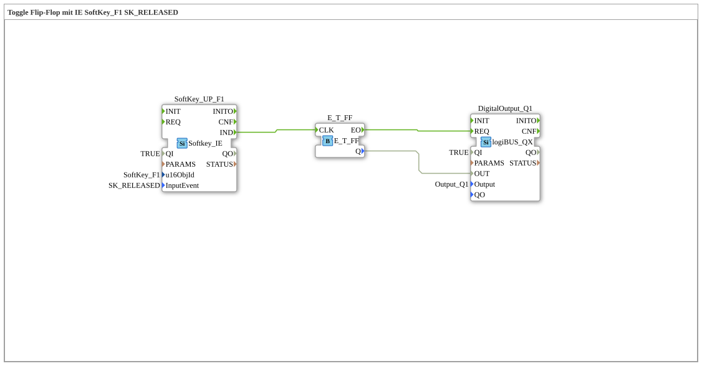

# Exercise_010b2: Toggle Flip-Flop with IE SoftKey_F1 SK_RELEASED

This article describes the logiBUS® exercise `Uebung_010b2`.

## 🎧 Podcast

* [ISO 11783-6: Understanding Softkeys and the Virtual Terminal – Your Key to Agricultural Machinery Mechatronics ](https://podcasters.spotify.com/pod/show/isobus-vt-objects/episodes/ISO-11783-6-Softkeys-und-das-Virtual-Terminal-verstehen--Dein-Schlssel-zur-Landmaschinen-Mechatronik-e36a8b0)

----

## Objective of the Exercise

Using specialized ISOBUS events to control software flip-flops.

-----

## Description and Components

[cite_start]The subapplication `Uebung_010b2.SUB` uses a flip-flop that is triggered by releasing a softkey[cite: 1].

### Function Blocks (FBs)

* **`SoftKey_UP_F1`**: Type `isobus::UT::io::Softkey::Softkey_IE`. It is configured for the event `SK_RELEASED`.

* **`E_T_FF`**: Toggle flip-flop.

-----

## Functionality

The event `IND` is only triggered when the user releases their finger from the softkey. This corresponds to intuitive click behavior. Each complete key press (press + release) toggles the light.