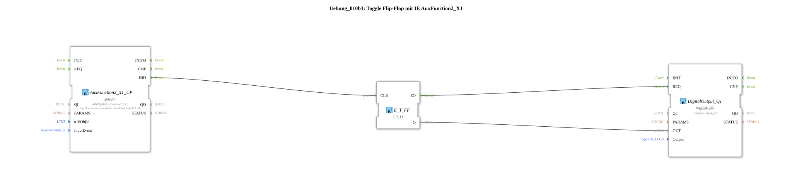

# Exercise_010b3: Toggle Flip-Flop with IE AuxFunction2_X1

This article describes the logiBUS® exercise `Uebung_010b3`.
----
## Objective of the Exercise

Using `Aux_IE` (Event) to control memory.

-----

## Description

[cite_start]In `Uebung_010b3.SUB`, an AUX function is used to toggle a flip-flop[cite: 1].

### Functionality

The event `AuxDisabled_START` is used. In ISOBUS terminology, this means the transition to the "Disabled" state. This corresponds to **releasing** a joystick button. The flip-flop therefore changes its state when the button is released.