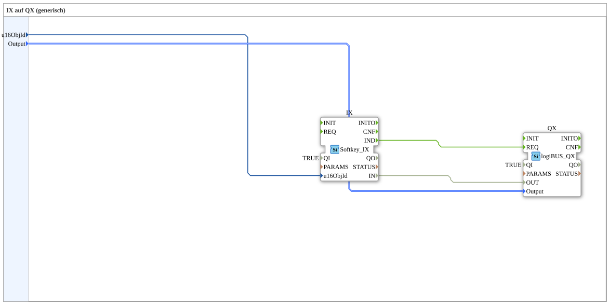

# Exercise_010b4_sub: IX to QX (generic)

## 🎧 Podcast

- [ISO 11783-6: Understanding Softkeys and the Virtual Terminal – Your Key to Agricultural Machinery Mechatronics ](https://podcasters.spotify.com/pod/show/isobus-vt-objects/episodes/ISO-11783-6-Softkeys-und-das-Virtual-Terminal-verstehen--Dein-Schlssel-zur-Landmaschinen-Mechatronik-e36a8b0)

## Overview

[cite_start]This sub-app type is used for the structured connection of ISOBUS softkeys to hardware outputs[cite: 1].

It combines a `Softkey_IX` instance and a `DigitalOutput_QX` block. The mapping between the virtual button and the physical lamp/valve can be configured directly in the sub-app using the parameters `u16ObjId` and `Output`. This allows for the creation of large operator matrices (as shown in Exercise 010b4) with minimal wiring effort in the main diagram.

## 🛠️ Related Exercises

- [Exercise_010b4](Uebung_010b4.md)
