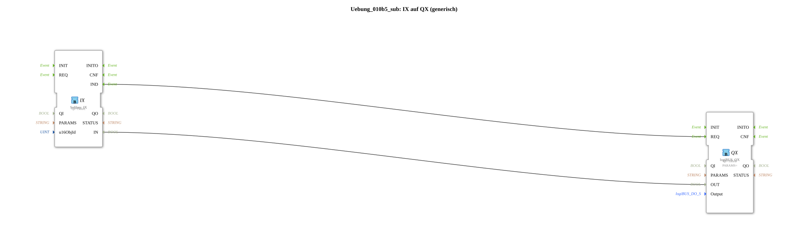

# Exercise_010b5_sub: IX on QX (generic)

## 🎧 Podcast

- [ISO 11783-6: Understanding Softkeys and the Virtual Terminal – Your Key to Agricultural Machinery Mechatronics ](https://podcasters.spotify.com/pod/show/isobus-vt-objects/episodes/ISO-11783-6-Softkeys-und-das-Virtual-Terminal-verstehen--Dein-Schlssel-zur-Landmaschinen-Mechatronik-e36a8b0)
## Overview

[cite_start]This type is functionally identical to `Uebung_010b4_sub` and is used to scale the application to 10 channels[cite: 1]. It enables the quick integration of additional control elements into the ISOBUS interface by simply copying and parameterizing the sub-app instances.

## 🛠️ Related Exercises

- [Exercise_010b5](Uebung_010b5.md)
