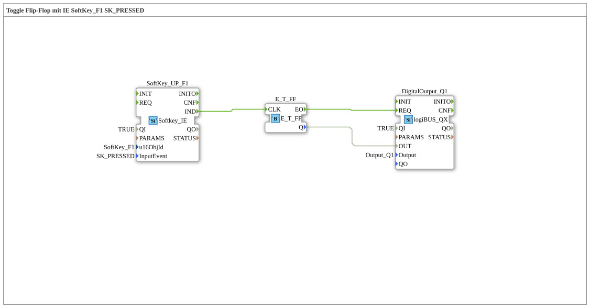

# Exercise_010b6: Toggle Flip-Flop with IE SoftKey_F1 SK_PRESSED

This article describes the logiBUS® exercise `Uebung_010b6`.
## 🎧 Podcast

* [ISO 11783-6: Understanding Softkeys and the Virtual Terminal – Your Key to Agricultural Machinery Mechatronics ](https://podcasters.spotify.com/pod/show/isobus-vt-objects/episodes/ISO-11783-6-Softkeys-und-das-Virtual-Terminal-verstehen--Dein-Schlssel-zur-Landmaschinen-Mechatronik-e36a8b0)

----

## Goal of the Exercise

Reaction at the earliest possible point of interaction.

-----

## Functionality

[cite_start]Uses the event `SK_PRESSED`[cite: 1]. The flip-flop at the output toggles the moment the user touches the touchscreen. This minimizes perceived latency but prevents subsequent cancellation by removing the finger.
