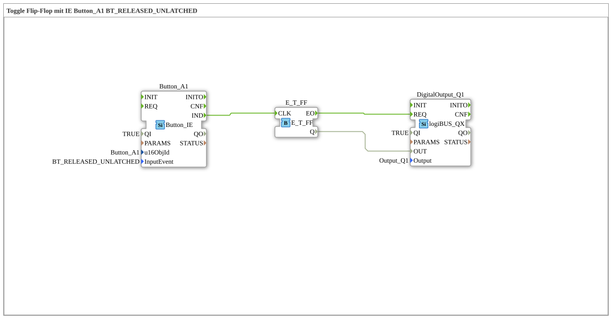

# Exercise_010b7: Toggle Flip-Flop with IE Button_A1 BT_RELEASED_UNLATCHED

This article describes the logiBUS® exercise `Uebung_010b7`.
----
## Functionality
[cite_start]Utilizes `Button_A1` with the event `BT_RELEASED_UNLATCHED`[cite: 1]. The event is triggered when a normal (non-latching) button on the workspace is released. This corresponds to a classic mouse click event.

