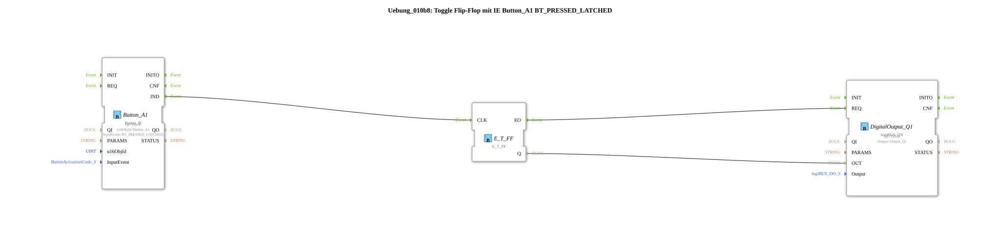

# Exercise_010b8: Toggle Flip-Flop with IE Button_A1 BT_PRESSED_LATCHED

This article describes the logiBUS® exercise `Uebung_010b8`.

----

## Functionality

[cite_start]Uses `Button_A1` with `BT_PRESSED_LATCHED`[cite: 1]. This event is specifically designed for buttons that should visually snap into place. The event is triggered as soon as the button changes to the "Activated/Snapped" state.

