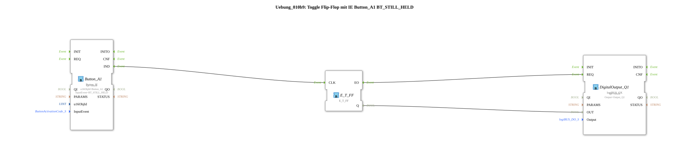

# Exercise_010b9: Toggle Flip-Flop with IE Button_A1 BT_STILL_HELD

[(https://notebooklm.google.com/notebook/a6872e59-1dfc-4132-a118-aff1bc7bc944)
This article describes the logiBUS® exercise `Uebung_010b9`.
----
## Objective of the Exercise

Using repeating events to generate blink signals or increment functions.

-----

## Functionality

[cite_start]Uses `Button_A1` with the event `BT_STILL_HELD`[cite: 1]. As noted in the comment, this event is repeated every 200ms as long as the finger remains on the button. Since the signal is routed to a toggle flip-flop, the hardware output blinks with a period of 400 ms (200 ms on, 200 ms off) as long as the button is pressed.

