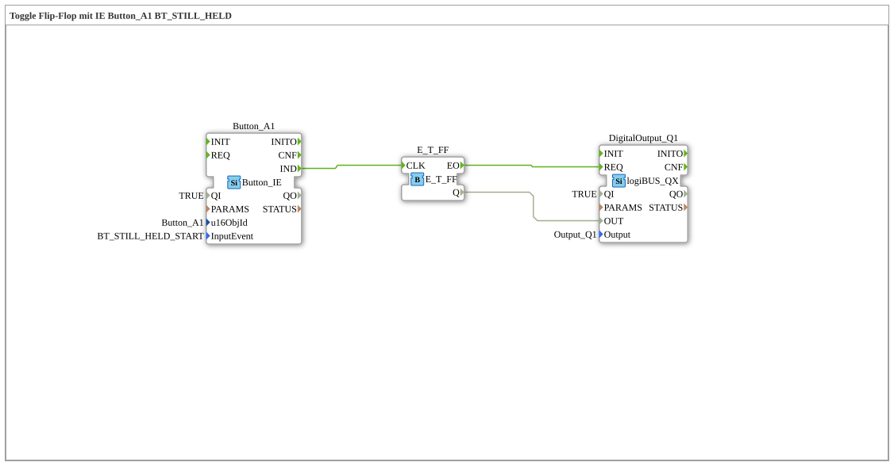

# Exercise_010bA: Toggle Flip-Flop with IE Button_A1 BT_STILL_HELD

This article describes the logiBUS® exercise `Uebung_010bA`.

----

## Functionality

[cite_start]Uses `Button_A1` with `BT_STILL_HELD_START`[cite: 1]. Unlike the simple `STILL_HELD`, this event is **not repeated**. It fires exactly once, as soon as the hold time has been exceeded. This corresponds to a clean "long press" evaluation.