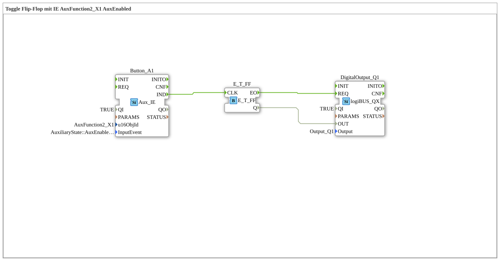

# Exercise_010bA2: Toggle Flip-Flop with IE AuxFunction2_X1 AuxEnabled

[(https://notebooklm.google.com/notebook/a6872e59-1dfc-4132-a118-aff1bc7bc944)
This article describes the logiBUS® exercise `Uebung_010bA2`. It covers the intricacies of the AUX specification regarding latching and momentary inputs.
----
## Functionality

[cite_start]Uses `AuxFunction2_X1` with the event `AuxEnabled`[cite: 1]. The behavior depends on the type of assigned control element (joystick button):

- For a **momentary operator** (non-latched), the event is sent only once when pressed.
- With a **latched operator**, the event is repeated cyclically as long as the switch is active.

This illustrates how the software reacts to the hardware characteristics of the joystick being used.
