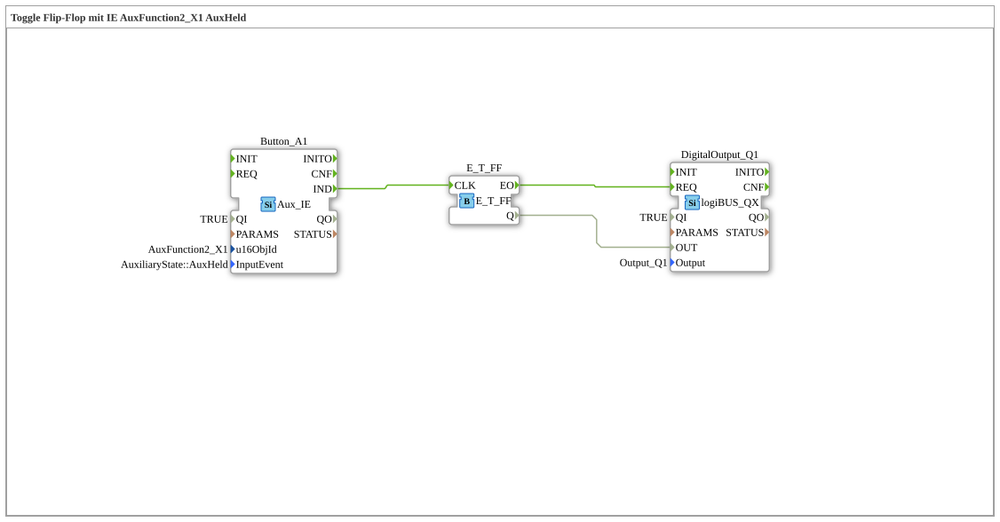

# Exercise_010bA3: Toggle Flip-Flop with IE AuxFunction2_X1 AuxHeld

This article describes the logiBUS® exercise `Uebung_010bA3`.

----

## Functionality

[cite_start]Uses `AuxFunction2_X1` with `AuxHeld`[cite: 1]. With a momentary control element, this event triggers a continuous sequence of events as long as the joystick button is held down. In combination with a toggle flip-flop, this creates a blinking effect at the output.

[]