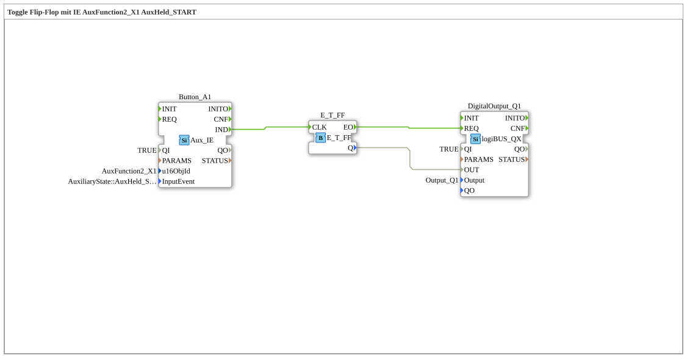

# Exercise_010bA4: Toggle Flip-Flop with IE AuxFunction2_X1 AuxHeld_START

This article describes the logiBUS® exercise `Uebung_010bA4`.

-----

## Functionality

[cite_start]Utilizes `AuxFunction2_X1` with `AuxHeld_START`[cite: 1]. Regardless of the type of control, this event is sent only **once** when the time threshold is reached. It is the preferred choice for long-press functions on ISOBUS joysticks.