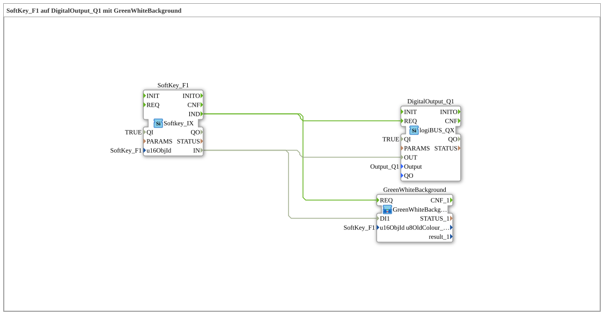

# Exercise_010c: SoftKey_F1 on DigitalOutput_Q1 with GreenWhiteBackground

[(https://notebooklm.google.com/notebook/a6872e59-1dfc-4132-a118-aff1bc7bc944)
This article describes the logiBUS® exercise `Uebung_010c`. Previously, the keys were only used for input. Now they receive dynamic feedback on the screen.

## 🎧 Podcast

- [ISO 11783-6: Understanding Softkeys and the Virtual Terminal – Your Key to Agricultural Machinery Mechatronics ](https://podcasters.spotify.com/pod/show/isobus-vt-objects/episodes/ISO-11783-6-Softkeys-und-das-Virtual-Terminal-verstehen--Dein-Schlssel-zur-Landmaschinen-Mechatronik-e36a8b0)

----

## Goal of the Exercise

Feedback to the operator through a color change of the virtual key.

-----

## Description and Components

[cite_start]The subapplication `Uebung_010c.SUB` extends the simple circuit with a feedback block[cite: 1].

### Function Blocks (FBs)

- **`SoftKey_F1`**: Input block.
- **`GreenWhiteBackground` (SubApp)**: A block from the `MyLib::sys` library. [cite_start]It changes the background of the softkey on the terminal [green when activated, white when idle](cite: 1).
- **`DigitalOutput_Q1`**: The physical output.

-----

## Functionality

The signal from the softkey is split:

1. One branch goes to the physical output `Q1`.
2. The second branch leads to the feedback module.

When the user presses the button, not only does the light on the machine illuminate, but the button on the terminal screen is also highlighted in green. This assures the user that their command has been registered by the system.
