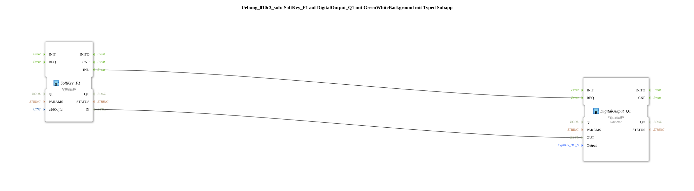

# Exercise_010c3_sub: SoftKey_F1 on DigitalOutput_Q1 with GreenWhiteBackground with Typed Subapp

## 🎧 Podcast



* [ISO 11783-6: Understanding Softkeys and the Virtual Terminal – Your Key to Agricultural Machinery Mechatronics ](https://podcasters.spotify.com/pod/show/isobus-vt-objects/episodes/ISO-11783-6-Softkeys-und-das-Virtual-Terminal-verstehen--Dein-Schlssel-zur-Landmaschinen-Mechatronik-e36a8b0)

## Overview

[cite_start]This sub-app type combines softkey input with automatic visual feedback on the terminal[cite: 1].

It bundles the building blocks `Softkey_IX`, `GreenWhiteBackground`, and `DigitalOutput_QX`. The user only needs to specify the softkey's `u16ObjId` and the physical `Output`. This function block ensures that with each press, both the hardware output is switched and the background color of the softkey on the terminal is changed (green/white). This significantly reduces the configuration effort for complex user interfaces.

## 🛠️ Related Exercises

* [Exercise_010c3](Uebung_010c3.md)]


```