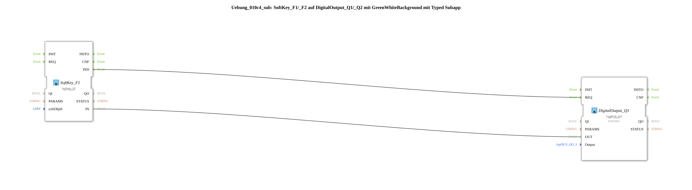

# Exercise_010c4_sub: SoftKey_F1/_F2 on DigitalOutput_Q1/_Q2 with GreenWhiteBackground with Typed Subapp

## 🎧 Podcast

- [ISO 11783-6: Understanding Softkeys and the Virtual Terminal – Your Key to Agricultural Machinery Mechatronics ](https://podcasters.spotify.com/pod/show/isobus-vt-objects/episodes/ISO-11783-6-Softkeys-und-das-Virtual-Terminal-verstehen--Dein-Schlssel-zur-Landmaschinen-Mechatronik-e36a8b0)
## Overview

[cite_start]This type is functionally identical to `Uebung_010c3_sub` and serves to cleanly structure multi-channel feedback applications[cite: 1]. By encapsulating it in a single type, any number of softkey output combinations with integrated color changes can be created quickly and without errors.

## 🛠️ Related exercises

- [Uebung_010c4](Uebung_010c4.md)
