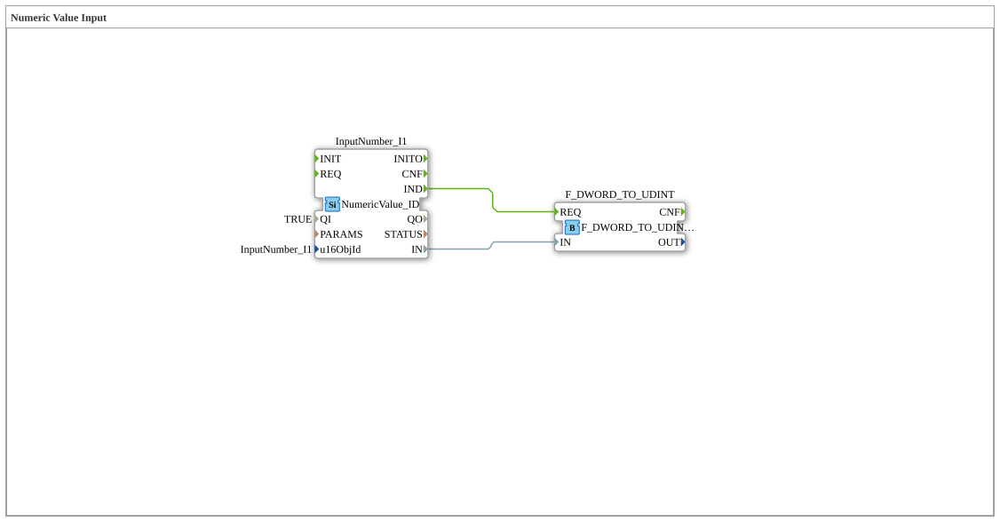

# Exercise_011: Numeric Value Input

[(https://notebooklm.google.com/notebook/a6872e59-1dfc-4132-a118-aff1bc7bc944)
This article describes the logiBUS® exercise `Uebung_011`. It demonstrates how to read numerical values (data) from an ISOBUS terminal.

## 🎧 Podcast



- [ISO 11783-6: Understanding Softkeys and the Virtual Terminal – Your Key to Agricultural Machinery Mechatronics ](https://podcasters.spotify.com/pod/show/isobus-vt-objects/episodes/ISO-11783-6-Softkeys-und-das-Virtual-Terminal-verstehen--Dein-Schlssel-zur-Landmaschinen-Mechatronik-e36a8b0)
- [The Three Timers of DIN EN 61131-3 Decoded – TP, TON & TOF Explained Precisely ](https://podcasters.spotify.com/pod/show/iec-61499-grundkurs-de/episodes/Die-drei-Timer-der-DIN-EN-61131-3-entschlsselt--TP--TON--TOF-przise-erklrt-e3dma77)
- [DIN EN 61131-3 vs. 61499-1: Your Guide Through the Standards of Industrial Automation ](https://podcasters.spotify.com/pod/show/iec-61499-grundkurs-de/episodes/DIN-EN-61131-3-vs--61499-1-Dein-Wegweiser-durch-die-Normen-der-Industrieautomatisierung-e36c6nc)
- [DIN EN 61131-3: The Heart of Agricultural and Construction Machinery Mechatronics and the Leap into the Future with Ob ](https://podcasters.spotify.com/pod/show/iec-61499-grundkurs-de/episodes/DIN-EN-61131-3-Das-Herz-der-Land--und-Baumaschinen-Mechatronik-und-der-Sprung-in-die-Zukunft-mit-Ob-e36c2mp)
- [FB_TOF and E_TOF: Delay Timers in IEC 61131-3 and 61499](https://podcasters.spotify.com/pod/show/iec-61499-grundkurs-de/episodes/FB_TOF-und-E_TOF-Verzgerungstimer-in-IEC-61131-3-und-61499-e368e2d)

----

## Objective of the Exercise

Learning how to process numeric variables in the ISOBUS context. This exercise demonstrates how a user can enter a number at the terminal and how this information arrives at the controller as a data-event combination.

-----

## Description and Components

[cite_start]The subapplication `Uebung_011.SUB` uses an input block for numeric values[cite: 1].

### Function Blocks (FBs)

- **`InputNumber_I1`**: Type `NumericValue_ID`. [cite_start]This block represents a numeric input field (Data Mask Object) on the ISOBUS terminal[cite: 1]. Once the user confirms the input, the module sends the new value to port `IN` (DWORD) and fires a `IND` event.
- **`F_DWORD_TO_UDINT`**: A conversion module that transforms the raw 32-bit value from the terminal into an unsigned integer (UDINT) for further logic processing.

-----

## Functionality

The logic waits for confirmation of the input at the terminal:

```xml
<EventConnections>
<Connection Source="InputNumber_I1.IND" Destination="F_DWORD_TO_UDINT.REQ"/>
</EventConnections>
<DataConnections>
<Connection Source="InputNumber_I1.IN" Destination="F_DWORD_TO_UDINT.IN"/>
</DataConnections>
```
## Application Example

**Setting Target Values**:

The farmer enters the desired application rate for seed (in kg/ha) or the target temperature for grain drying on the terminal. The software immediately processes this numerical value.
