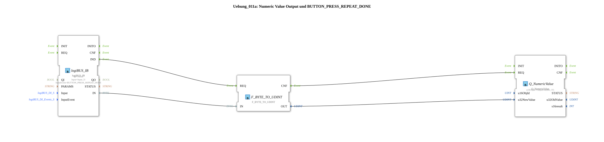

# Exercise_011a: Numeric Value Output and BUTTON_PRESS_REPEAT_DONE

This article describes the logiBUS® exercise `Uebung_011a`. It delves deeper into the interaction between button events and numeric displays on the terminal.
----
## Objective of the Exercise

Using the `BUTTON_PRESS_REPEAT_DONE` event to update a display object.

-----

## Description and Components

[cite_start]In `Uebung_011a.SUB`, a byte value is read from a button and sent to a numeric display on the terminal.[cite: 1]

### Function Blocks (FBs)

* **`logiBUS_IB`**: Input block for byte values. It is configured for the event `BUTTON_PRESS_REPEAT_DONE`.
* **`Q_NumericValue`**: Output block for displaying a number on the terminal.

-----

## Functionality

The special feature is the choice of input event:

* **`BUTTON_PRESS_REPEAT`**: Would continuously send events while pressed (blinking effect).
* **`BUTTON_PRESS_REPEAT_DONE`**: Fires only **once**, namely when the user finally releases the button after (possibly repeated) presses.

The logic ensures that the current byte value of the button (e.g., an ID or a counter reading) is only transmitted to the terminal at the end of the interaction.

-----

## Application Example

**Counter Transmission**:

An operator holds down a button to increment a value internally. To prevent the CAN bus from being burdened by constant display updates, the terminal display is only updated when the button is released (`REPEAT_DONE`).