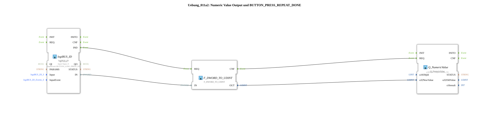

# Exercise_011a2: Numeric Value Output and BUTTON_PRESS_REPEAT_DONE

This article describes the logiBUS® exercise `Uebung_011a2`.
----
## Overview
[cite_start]Structurally identical to `Uebung_011a`, this variant uses the event `BUTTON_LONG_PRESS_UP` at the input block `logiBUS_ID`[cite: 1]. The display on the terminal is only updated here when a previously detected long key press has been released. This demonstrates another variant of interaction confirmation for numeric values.

[cite_start]Structurally identical to `Uebung_011a`, this variant uses the event `BUTTON_LONG_PRESS_UP` at the input block `logiBUS_ID`. The display on the terminal is only updated here when a previously detected long key press has been ended by releasing the key. This demonstrates another variant of interaction confirmation for numeric values.

[cite_start]