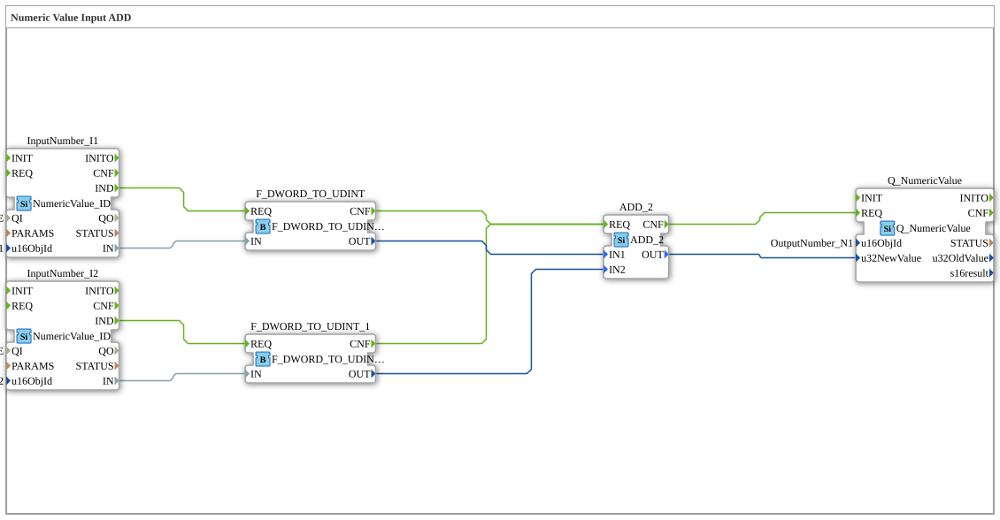

# Exercise_011b1: Numeric Value Input ADD

* * * * * * * * * *

## Introduction

This exercise demonstrates the processing of two numeric input values via ISOBUS (UT). The values are received as `DWORD`, converted to `UDINT`, added, and the result is provided as a numeric output value. It serves as an introductory example of combining data type conversion, arithmetic operations, and the use of the ISOBUS Numeric Value interface.

## Function Blocks (FBs) Used

- **InputNumber_I1** / **InputNumber_I2**
- **Type**: `isobus::UT::io::NumericValue::NumericValue_ID`
- **Parameters**:
- `QI` = `TRUE` (Input enabled)
- `u16ObjId` = `"InputNumber_I1"` or `"InputNumber_I2"` (respective object ID)
- **Function**: Provides a numeric input value via ISOBUS. Upon an incoming event (IND), the current value is output at data output `IN` (of type `DWORD`).
- **F_DWORD_TO_UDINT** / **F_DWORD_TO_UDINT_1**
- **Type**: `iec61131::conversion::F_DWORD_TO_UDINT`
- **Parameters**: none
- **Function**: Converts a `DWORD` value to a `UDINT` value. The converted value is output at `OUT`. The conversion is started by an event at input `REQ`; upon completion, output `CNF` is activated.

- **ADD_2**

- **Type**: `iec61131::arithmetic::ADD_2`
- **Parameters**: none
- **Function**: Adds two `UDINT` values at inputs `IN1` and `IN2`. The result is output at `OUT` (also `UDINT`). An event at `REQ` starts the calculation; upon completion, `CNF` is activated.

- **Q_NumericValue**

- **Type**: `isobus::UT::Q::Q_NumericValue`
- **Parameters**:
- `u16ObjId` = `"OutputNumber_N1"`
- **Function**: Sends a numeric value via ISOBUS. The value to be sent is expected at data input `u32NewValue` (of type `UDINT`). An event at `REQ` triggers the output; output `CNF` confirms successful transmission.

## Program Flow and Connections

The flow is controlled by event and data connections in the network:

1. **Value Input** – The function blocks `InputNumber_I1` and `InputNumber_I2` wait for incoming ISOBUS messages. As soon as a value is received, the event `IND` is triggered.
2. **Conversion** – The event `IND` from `InputNumber_I1` triggers `F_DWORD_TO_UDINT` (via `REQ`). Simultaneously, `F_DWORD_TO_UDINT_1` is triggered by `IND` from `InputNumber_I2`. The converted `UDINT` values are available at the outputs `OUT` of the converters.
3. **Addition** – After the conversion is complete (each `CNF` event), the function block `ADD_2` is called via its input `REQ`. The converted values from both converters are transferred via the data connections to `IN1` and `IN2` from `ADD_2`.
4. **Output** – The `CNF` event of `ADD_2` triggers the function block `Q_NumericValue`. The result of the addition is present at its data input `u32NewValue`. The function block sends this value via ISOBUS to the object ID `OutputNumber_N1`.

Notes for the user:

- The object IDs (`InputNumber_I1`, `InputNumber_I2`, `OutputNumber_N1`) must match the objects configured in the ISOBUS system.
- This exercise requires basic knowledge of the 4diac IDE and IEC 61499 event control.
- Difficulty level: Beginner.

## Summary

Exercise **Exercise_011b1** illustrates the entire data path from ISOBUS input through data type conversion and arithmetic processing to ISOBUS output. It is a typical example of structured, event-driven programming with 4diac and IEC 61499. The clear separation of event and data flows facilitates understanding and reusability of the function blocks.

---

### 🌐 Related topic subpages on ms-muc-docs.de

- [🌐 Eclipse 4diac IDE & color reference on ms-muc-docs.de](https://www.ms-muc-docs.de/iec-61499/eclipse-4diac/)

]
