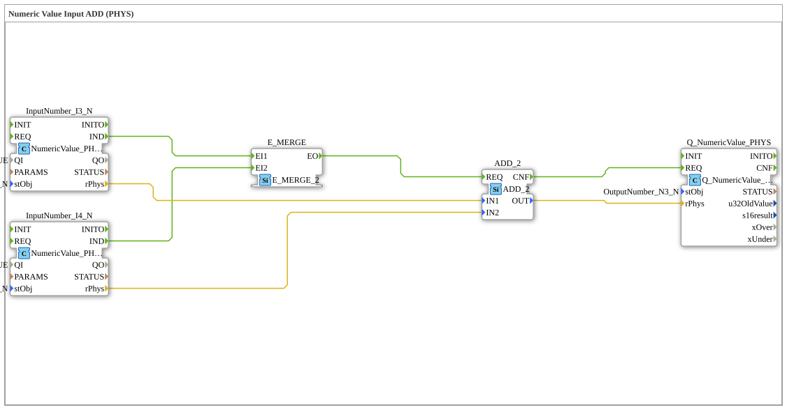

# Exercise_011b1_PHYS: Numeric Value Input ADD (PHYS)

* * * * * * * * * *

## Introduction

This exercise demonstrates the addition of two physical values (REAL) using the NumericValue pattern from the isobus library. The values are read in via the function blocks `InputNumber_I3` and `InputNumber_I4`, added together, and the result is output via the function block `Q_NumericValue_PHYS`.

## Function Blocks (FBs) Used

- **InputNumber_I3** (Type: `isobus::UT::io::NumericValue::NumericValue_PHYS`)
- Parameters:
- `QI` = `TRUE`
- `stObj` = `InputNumber_I3`
- Event output: `IND` (Indication) – triggered by a value change
- Data output: `rPhys` (REAL) – the current physical value
- **InputNumber_I4** (Type: `isobus::UT::io::NumericValue::NumericValue_PHYS`)
- Parameters:
- `QI` = `TRUE`
- `stObj` = `InputNumber_I4`
- Event output: `IND`
- Data output: `rPhys`
- **ADD_2** (Type: `iec61131::arithmetic::ADD_2`)
- Parameters: none
- Event input: `REQ` (Request) – triggers the addition
- Event output: `CNF` (Confirmation) – signals the completion of the calculation
- Data inputs: `IN1` (REAL), `IN2` (REAL)
- Data output: `OUT` (REAL) – sum of the two input values
- **Q_NumericValue_PHYS** (Type: `isobus::UT::Q::Q_NumericValue_PHYS`)
- Parameters:
- `stObj` = `OutputNumber_N3`
- Event input: `REQ` – takes the value on the event
- Data input: `rPhys` (REAL) – the physical value to be set

### Functionality

The two input blocks generate an event (`IND`) when a value changes. This event is sent to the adder `ADD_2` (`REQ`). Simultaneously, the current physical values (`rPhys`) are passed from `ADD_2` to the data inputs `IN1` and `IN2`. After the calculation, `ADD_2` sends an acknowledgment (`CNF`) to the output block `Q_NumericValue_PHYS`, which receives the result and stores it internally.

## Program Flow and Connections

The flow is event-driven:

1. If the value at `InputNumber_I3` or `InputNumber_I4` changes, the `IND` event is triggered.
2. Both `IND` events are connected to the `REQ` input of `ADD_2` (OR operation – either one triggers the addition).
3. `ADD_2` adds the two REAL values and outputs the result to `OUT`.
4. After the addition, `ADD_2` sends the `CNF` event, which triggers the function block `Q_NumericValue_PHYS` to set the output value.

**Data Connections**:

- `InputNumber_I3.rPhys` → `ADD_2.IN1`
- `InputNumber_I4.rPhys` → `ADD_2.IN2`
- `ADD_2.OUT` → `Q_NumericValue_PHYS.rPhys`

**Event Connections**:

- `InputNumber_I3.IND` → `ADD_2.REQ`
- `InputNumber_I4.IND` → `ADD_2.REQ`
- `ADD_2.CNF` → `Q_NumericValue_PHYS.REQ`

## Summary

This exercise demonstrates the use of physical values (REAL) with the NumericValue pattern from the Isobus library. Two inputs are added and the result is passed to an output. The PHYS variant works with floating-point numbers, thus enabling the processing of continuous measured values. Event-driven execution ensures that the calculation is only performed when changes occur.
