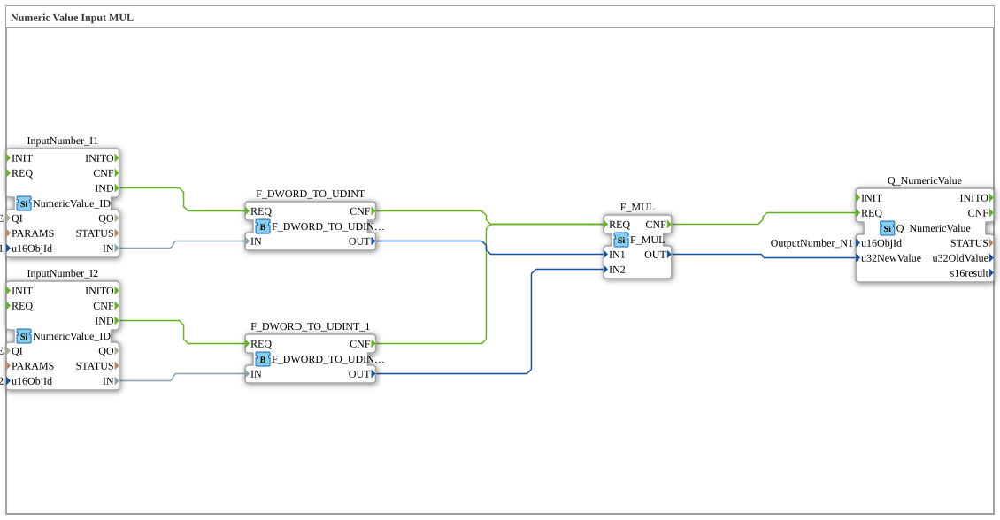

# Exercise_011b2: Numeric Value Input MUL

*Image to follow (if available)*

* * * * * * * * * *
## Introduction

Exercise **Exercise_011b2** performs a simple multiplication of two numeric values. Two inputs (InputNumber\_I1 and InputNumber\_I2) each read a DWORD value from the ISOBUS network, convert it to the UDINT data type, and multiply the results together. The product is written back to the bus via an output (OutputNumber\_N1). This exercise demonstrates the use of input/output function blocks for numeric values and arithmetic operations using IEC 61131 function blocks.

## Function Blocks (FBs) Used

- **InputNumber\_I1** (Type: `isobus::UT::io::NumericValue::NumericValue_ID`)
- Parameters: `QI` = `TRUE`, `u16ObjId` = `InputNumber_I1`
- Event Output: `IND`
- Data Output: `IN` (DWORD)
- Function: Reads the current numeric value of the ISOBUS object "InputNumber_I1" and provides it as a DWORD.
- **InputNumber\_I2** (Type: `isobus::UT::io::NumericValue::NumericValue_ID`)
- Parameters: `QI` = `TRUE`, `u16ObjId` = `InputNumber_I2`
- Event output: `IND`
- Data output: `IN` (DWORD)
- Function: Reads the current numeric value of the ISOBUS object "InputNumber_I2" and provides it as a DWORD.

- **F\_DWORD\_TO\_UDINT** (Type: `iec61131::conversion::F_DWORD_TO_UDINT`)

- Event input: `REQ`, Event output: `CNF`
- Data input: `IN` (DWORD), Data output: `OUT` (UDINT)
- Function: Converts the incoming DWORD value to an unsigned 32-bit integer (UDINT).
- **F\_DWORD\_TO\_UDINT\_1** (Type: `iec61131::conversion::F_DWORD_TO_UDINT`)
- Same configuration and function as above, used to convert the second input value.
- **F\_MUL** (Type: `iec61131::arithmetic::F_MUL`)
- Event input: `REQ`, Event output: `CNF`
- Data inputs: `IN1`, `IN2` (both UDINT), Data output: `OUT` (UDINT)
- Function: Multiplies the two incoming UDINT values and outputs the product as a UDINT.

- **Q\_NumericValue** (Type: `isobus::UT::Q::Q_NumericValue`)

- Parameters: `u16ObjId` = `OutputNumber_N1`
- Event input: `REQ`
- Data input: `u32NewValue` (UDINT)
- Function: Writes the passed numeric value to the ISOBUS object "OutputNumber_N1".

## Program Flow and Connections

1. **Event Control**:
- As soon as `InputNumber_I1` provides a new value, its event output `IND` fires. This event is connected to the `REQ` input of `F_DWORD_TO_UDINT`.
- Simultaneously, `InputNumber_I2.IND` triggers the second converter, `F_DWORD_TO_UDINT_1`.
- After each conversion is complete, the `CNF` outputs of both converters fire – both connected to the `REQ` input of `F_MUL`. (Note: The two events are implicitly ORed when connected, so each new input triggers a recalculation.)
- After the multiplication, `F_MUL.CNF` fires and triggers the output function block `Q_NumericValue`.

qzmsdocs q a t` ... 2. **Data Flow**:

- The data outputs `IN` of the input function blocks are directly connected to the data inputs `IN` of the respective converters.
- The outputs `OUT` of the converters (UDINT) are routed to `F_MUL.IN1` (from `I1`) or `F_MUL.IN2` (from `I2`).
- The product `F_MUL.OUT` is written to the input `u32NewValue` of `Q_NumericValue` and output from there to the bus.

The entire logic is event-driven: As soon as a new measured value is received at one of the inputs, the entire chain is processed and the output is updated.

## Summary

This exercise demonstrates the use of ISOBUS Numeric Value function blocks and IEC 61131 conversion and arithmetic blocks in a 4diac sub-application. The goal is the simple multiplication of two bus values. Separate event chaining ensures that each new input value is processed immediately. This exercise serves as a foundation for more complex calculations with multiple inputs and outputs.

---

### 🌐 Related topic subpages on ms-muc-docs.de

* [🌐 Eclipse 4diac IDE & color reference on ms-muc-docs.de](https://www.ms-muc-docs.de/iec-61499/eclipse-4diac/)

]
