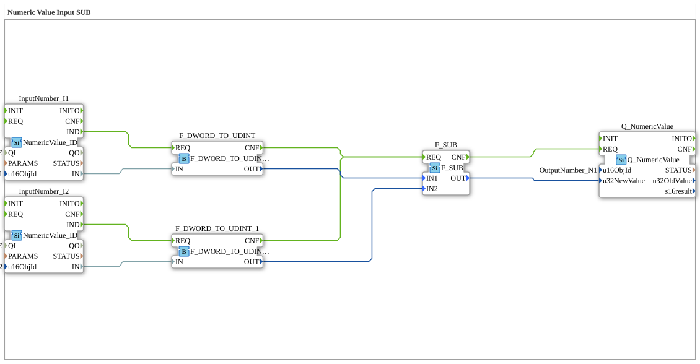

# Exercise_011b3: Numeric Value Input SUB



* * * * * * * * * *
## Introduction

Exercise **Exercise_011b3** performs a simple subtraction of two numeric values read from the
ISOBUS network. Unlike the earlier exercises in this series, it exists to demonstrate a real
finding on ESP32-P4 hardware: `F_SUB` computes IEC 61131-3's specified two's-complement
wraparound on underflow, and for the unsigned `UDINT` type used here that is dangerous for real
measurement values (setpoint differences, remaining-distance calculations). With
`InputNumber_I1 = 1` and `InputNumber_I2 = 12`, the exercise outputs `UDINT#4294967285`
instead of the mathematically expected `-11` — because `UDINT` cannot represent a negative
number, and plain subtraction wraps around instead of reporting the underflow. This finding
directly motivated the [SafeArithmetic](../../../Bibliotheken/ExternalLibraries/SafeArithmetic/index.md)
library and its [SAFE_SUB](../../../Bibliotheken/ExternalLibraries/SafeArithmetic/arithmetic/SAFE_SUB.md)
block — see [Exercise_011b6](Uebung_011b6.md) for the same scenario re-run with `SAFE_SUB`.

## Function Blocks (FBs) Used

- **InputNumber_I1** (Type: `isobus::UT::io::NumericValue::NumericValue_ID`)
  - Parameters: `QI` = `TRUE`, `u16ObjId` = `InputNumber_I1`
  - Event Output: `IND`, Data Output: `IN` (DWORD)
  - Reads the current numeric value of the ISOBUS object "InputNumber_I1".
- **InputNumber_I2** (Type: `isobus::UT::io::NumericValue::NumericValue_ID`)
  - Same as above, for the ISOBUS object "InputNumber_I2".
- **F_DWORD_TO_UDINT** / **F_DWORD_TO_UDINT_1** (Type: `iec61131::conversion::F_DWORD_TO_UDINT`)
  - Convert the incoming DWORD values to UDINT.
- **F_SUB** (Type: `iec61131::arithmetic::F_SUB`)
  - Data inputs: `IN1` (minuend), `IN2` (subtrahend), both UDINT. Data output: `OUT` (UDINT).
  - Computes `IN1 - IN2` with plain IEC 61131-3 (wraparound) semantics.
- **Q_NumericValue** (Type: `isobus::UT::Q::Q_NumericValue`)
  - Parameter: `u16ObjId` = `OutputNumber_N1`. Writes `F_SUB.OUT` back to the ISOBUS network.

## Program Flow and Connections

1. **Event Control**: `InputNumber_I1.IND`/`InputNumber_I2.IND` each trigger their respective
   `F_DWORD_TO_UDINT` converter's `REQ`. Both converters' `CNF` outputs are connected to
   `F_SUB.REQ` (implicitly OR'd — either new input triggers a recalculation).
   `F_SUB.CNF` triggers `Q_NumericValue.REQ`.
2. **Data Flow**: `InputNumber_I1.IN`/`InputNumber_I2.IN` (DWORD) go to the converters' `IN`.
   Converter `OUT` (UDINT) values go to `F_SUB.IN1` (from I1) and `F_SUB.IN2` (from I2).
   `F_SUB.OUT` goes to `Q_NumericValue.u32NewValue`.

## Hardware Finding

`InputNumber_I1 = UDINT#1`, `InputNumber_I2 = UDINT#12`:

```
F_SUB.OUT = UDINT#1 - UDINT#12 = UDINT#4294967285   (LIMIT_HIT does not exist on F_SUB)
```

This is the correct IEC 61131-3-specified two's-complement wraparound for `UDINT` — not a
FORTE bug — but it silently produces a nonsensical result for a real subtraction where the true
answer is negative and unrepresentable in an unsigned type. See
[Exercise_011b6](Uebung_011b6.md) for the fix.

## Summary

This exercise is the starting point of a small series: it reproduces, on real hardware, exactly
the silent-wraparound problem that the SafeArithmetic library exists to solve. Compare its
output directly against [Exercise_011b6](Uebung_011b6.md) (same inputs, `SAFE_SUB` instead of
`F_SUB`).
