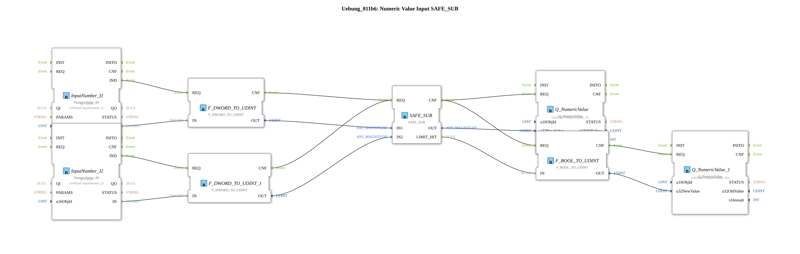

# Exercise_011b6: Numeric Value Input SAFE_SUB



* * * * * * * * * *
## Introduction

Exercise **Exercise_011b6** is the direct fix for [Exercise_011b3](Uebung_011b3.md): the same
subtraction of two numeric values read from the ISOBUS network, but using
[SAFE_SUB](../../../Bibliotheken/ExternalLibraries/SafeArithmetic/arithmetic/SAFE_SUB.md)
instead of plain `F_SUB`. `SAFE_SUB.LIMIT_HIT` is converted to `UDINT` and written to
`OutputNumber_N2`, so the underflow that `Exercise_011b3` produced silently is now directly
visible on the ISOBUS network.

## Function Blocks (FBs) Used

- **InputNumber_I1** / **InputNumber_I2** (Type: `isobus::UT::io::NumericValue::NumericValue_ID`)
  - Read the current numeric values of the ISOBUS objects "InputNumber_I1"/"InputNumber_I2".
- **F_DWORD_TO_UDINT** / **F_DWORD_TO_UDINT_1** (Type: `iec61131::conversion::F_DWORD_TO_UDINT`)
  - Convert the incoming DWORD values to UDINT.
- **SAFE_SUB** (Type: `SafeArithmetic::arithmetic::SAFE_SUB`)
  - Data inputs: `IN1` (minuend), `IN2` (subtrahend), both UDINT. Data outputs: `OUT` (UDINT,
    clamped difference), `LIMIT_HIT` (BOOL, TRUE if the subtraction underflowed/overflowed).
- **Q_NumericValue** (Type: `isobus::UT::Q::Q_NumericValue`, `u16ObjId` = `OutputNumber_N1`)
  - Writes `SAFE_SUB.OUT` back to the ISOBUS network.
- **F_BOOL_TO_UDINT** (Type: `iec61131::conversion::F_BOOL_TO_UDINT`)
  - Converts `SAFE_SUB.LIMIT_HIT` (BOOL) to `UDINT` (`1`/`0`).
- **Q_NumericValue_1** (Type: `isobus::UT::Q::Q_NumericValue`, `u16ObjId` = `OutputNumber_N2`)
  - Writes the converted `LIMIT_HIT` back to the ISOBUS network.

## Program Flow and Connections

1. **Event Control**: `InputNumber_I1.IND`/`InputNumber_I2.IND` trigger their converters' `REQ`.
   Both converters' `CNF` outputs trigger `SAFE_SUB.REQ`. `SAFE_SUB.CNF` triggers both
   `Q_NumericValue.REQ` (the difference) and `F_BOOL_TO_UDINT.REQ` (the limit flag), and
   `F_BOOL_TO_UDINT.CNF` triggers `Q_NumericValue_1.REQ`.
2. **Data Flow**: converted `IN1`/`IN2` (UDINT) go to `SAFE_SUB.IN1`/`IN2`. `SAFE_SUB.OUT`
   goes to `Q_NumericValue.u32NewValue`. `SAFE_SUB.LIMIT_HIT` goes to `F_BOOL_TO_UDINT.IN`,
   whose `OUT` goes to `Q_NumericValue_1.u32NewValue`.

## Hardware Result (Same Inputs as Exercise_011b3)

`InputNumber_I1 = UDINT#1`, `InputNumber_I2 = UDINT#12`:

```
SAFE_SUB.OUT = 0          (clamped: unsigned subtraction can only ever underflow)
SAFE_SUB.LIMIT_HIT = TRUE  ->  OutputNumber_N1 = 0, OutputNumber_N2 = 1
```

Directly confirms the fix: instead of [Exercise_011b3](Uebung_011b3.md)'s silent
`UDINT#4294967285`, the true-negative-and-unrepresentable result is now clamped to `0` with an
explicit, observable `LIMIT_HIT = TRUE`.

## Summary

Run [Exercise_011b3](Uebung_011b3.md) and this exercise side by side with the same inputs to see
the exact before/after of the `SafeArithmetic` library's fix for the original hardware finding.
