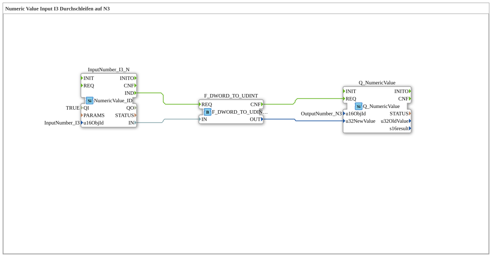

# Exercise_011c: Passing Through Numeric Value Input I3 to N3

* * * * * * * * * *
## Introduction
This exercise demonstrates the simple pass-through of a numeric value from an ISOBUS input object (InputNumber_I3) to an output object (OutputNumber_N3). The DWORD value coming from the bus is converted to a UDINT before being passed to the output object. This exercise is a basic example of using the **4diac-IDE** in the context of ISOBUS (ISO 11783) and shows how function blocks are interconnected for data processing and forwarding.
## Function Blocks (FBs) Used

### InputNumber_I3
- **Type**: `isobus::UT::io::NumericValue::NumericValue_ID`
- **Parameters**:
- `QI` = `TRUE`
- `u16ObjId` = `InputNumber_I3`
- **Event Inputs**: (implicit by the type, default: INIT, REQ, etc.)
- **Event Outputs**: `IND` (triggered when a new value arrives from the bus)
- **Data Inputs**: (no additional inputs besides the implicit ones)
- **Data Outputs**: `IN` (outgoing value as DWORD)
- **Functionality**: This FB reads the The current value of the ISOBUS object with ID `InputNumber_I3` is displayed. Whenever the value changes on the bus, the event `IND` is triggered, and the current value is provided as a DWORD at output `IN`.

``` ### F_DWORD_TO_UDINT
- **Type**: `iec61131::conversion::F_DWORD_TO_UDINT`
- **Parameters**: none additional
- **Event Inputs**: `REQ` (Request conversion)
- **Event Outputs**: `CNF` (Confirmation after successful conversion)
- **Data Inputs**: `IN` (DWORD value)
- **Data Outputs**: `OUT` (Converted UDINT value)
- **Functionality**: The function block converts the 32-bit DWORD into an unsigned 32-bit integer (UDINT). The conversion is triggered by an event at `REQ`; Upon completion, `CNF` is triggered.

### Q_NumericValue
- **Type**: `isobus::UT::Q::Q_NumericValue`
- **Parameters**:
- `u16ObjId` = `OutputNumber_N3`
- **Event Inputs**: `REQ` (Request value write)
- **Event Outputs**: (No explicit outputs in the network)
- **Data Inputs**: `u32NewValue` (UDINT value to be written)
- **Data Outputs**: None
- **Functionality**: This function block writes a new value (UDINT) to the ISOBUS object with the ID `OutputNumber_N3`. When an event occurs at `REQ`, the corresponding value is transmitted to the bus.

... ## Program Flow and Connections

The connections are made in a simple event and data chain:

1. **Event Connections**:

- `InputNumber_I3.IND` → `F_DWORD_TO_UDINT.REQ`
- `F_DWORD_TO_UDINT.CNF` → `Q_NumericValue.REQ`

2. **Data Connections**:

- `InputNumber_I3.IN` → `F_DWORD_TO_UDINT.IN`
- `F_DWORD_TO_UDINT.OUT` → `Q_NumericValue.u32NewValue`

**Process**:

- As soon as the ISOBUS object `InputNumber_I3` receives a new value from the bus (e.g., via an external control unit), the event `IND` is logged on the FB `InputNumber_I3` is triggered.
- This event triggers the conversion in function block `F_DWORD_TO_UDINT` (via its `REQ` input).
- After the conversion is complete, `F_DWORD_TO_UDINT` outputs the event `CNF`, which prompts function block `Q_NumericValue` to write the converted value to the output object `OutputNumber_N3`.

Thus, the incoming value is passed on to the output object almost instantly (delayed only by the conversion process).

## Summary

Exercise **Exercise_011c** demonstrates basic data flow processing with 4diac using ISOBUS function blocks. It provides:

- Reading a numeric value from an ISOBUS object,
- Data type conversion (DWORD → UDINT),
- Outputting the converted value to a second object,
- Event-driven chaining of FB instances.

This simple pass-through can serve as the basis for more complex signal processing chains where values need to be exchanged between different bus participants and, if necessary, scaled or converted.

--

### 🌐 Related topic subpages on ms-muc-docs.de
* [🌐 Eclipse 4diac IDE & color reference on ms-muc-docs.de](https://www.ms-muc-docs.de/iec-61499/eclipse-4diac/)

]