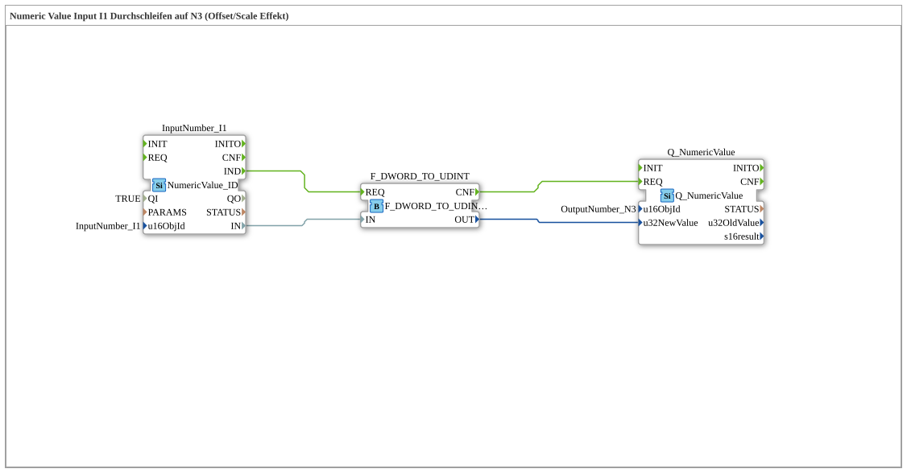

# Exercise_011d: Passing Numeric Value Input I1 to N3 (Offset/Scale Effect)

* * * * * * * * * *
## Introduction
In this exercise, a numeric value is read from an input device (I1) and passed unchanged to an output device (N3). Using a conversion block, the incoming 32-bit value of `DWORD` is converted to `UDINT`. This type conversion results in an offset/scaling effect, which shifts the output relative to the raw value.

An example illustrates the effect:

- Input 100000 → N3 displays 0.00
- Input 50000 → N3 displays -500.00

This exercise demonstrates the basic handling of the `NumericValue` interface and the effects of data type conversions.

---

## Function Blocks (FBs) Used

Three function blocks are used in the exercise network. No sub-blocks are present.

| Name | Type | Parameters |

|------|-----|-----------|

| `InputNumber_I1` | `isobus::UT::io::NumericValue::NumericValue_ID` | `QI = TRUE`, `u16ObjId = "InputNumber_I1"` |

| `F_DWORD_TO_UDINT` | `iec61131::conversion::F_DWORD_TO_UDINT` | (no parameters) |

| `Q_NumericValue` | `isobus::UT::Q::Q_NumericValue` | `u16ObjId = "OutputNumber_N3"` |

- **`InputNumber_I1`** – Reads a raw numeric value from input I1 as `DWORD` (32-bit) and outputs it to data output `IN`, along with an event `IND` when new data is provided.

Reads a raw numeric value from input I1 as `DWORD` (32-bit) and outputs it to data output `IN`, as well as an event `IND` when new data is provided. - **`F_DWORD_TO_UDINT`** – Converts the received `DWORD` value into an unsigned 32-bit integer (`UDINT`). This conversion changes the interpretation of the bit sequence and generates the described offset.

- **`Q_NumericValue`** – Receives the converted `UDINT` value via the data input `u32NewValue` and displays it at output N3. This function block is triggered by an event at `REQ`.

---

## Program Flow and Connections

Processing is event-driven:

1. **Event Chain**

- `InputNumber_I1` sends the event `IND` when a new input value is received.
- This triggers the `REQ` input of `F_DWORD_TO_UDINT` via an event connection.
- After conversion, `F_DWORD_TO_UDINT` sends the event `CNF`, which in turn triggers the `REQ` input of `Q_NumericValue`.
... 2. **Data Connections**

- The output `IN` of `InputNumber_I1` (data type `DWORD`) is connected to the input `IN` of `F_DWORD_TO_UDINT`.
- The output `OUT` of `F_DWORD_TO_UDINT` (data type `UDINT`) is connected to the data input `u32NewValue` of `Q_NumericValue`.

**Learning Objectives of this Exercise:**

- Understanding the functionality of the `NumericValue` input and output blocks.
- Recognizing the impact of data type conversions (DWORD → UDINT) on numeric values.
- Practical handling of event and data connections in 4diac.
- Interpreting offset/scaling effects through type conversion.

This exercise requires basic knowledge of the 4diac IDE and the isobus library. It can be started directly after importing the subapp type in the network editor – the values are automatically updated when connected to a corresponding input device.

---

## Summary

Exercise **Exercise_011d** demonstrates passing a numeric value from an input (I1) to an output (N3) using a conversion block. The conversion of `DWORD` to `UDINT` results in an offset/scaling effect that shifts the output relative to the raw value. The basic principle of data processing is illustrated using the `NumericValue` building blocks through simple event and data chaining, highlighting the importance of data types.

---

### 🌐 Related topic subpages on ms-muc-docs.de
* [🌐 Eclipse 4diac IDE & color reference on ms-muc-docs.de](https://www.ms-muc-docs.de/iec-61499/eclipse-4diac/)
