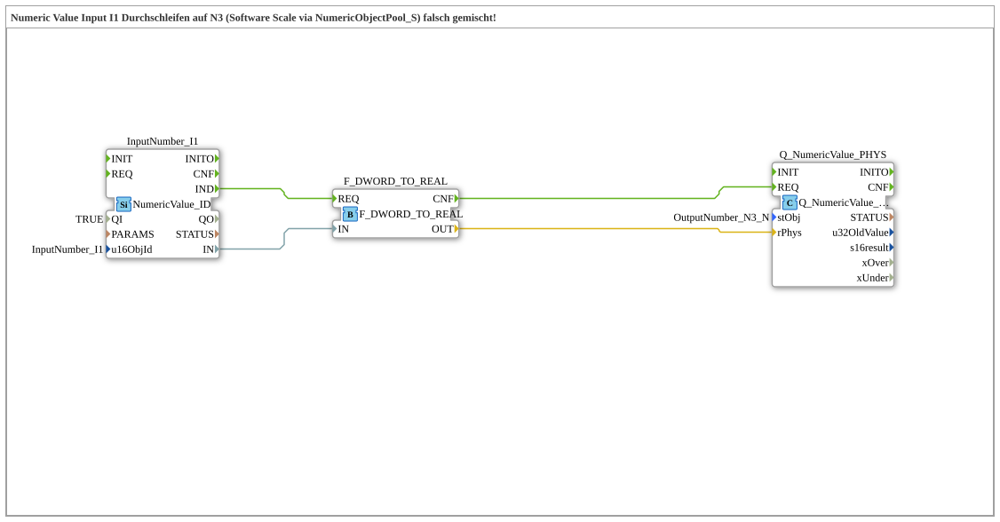

# Exercise_011e_MIX: Passing through Numeric Value Input I1 to N3 (Software Scale via NumericObjectPool_S) incorrectly mixed!

* * * * * * * * * *
## Introduction
This exercise demonstrates an **incompatible interaction** between two different namespaces in the isobus context. The goal is to pass a numeric value from an input (I1) to an output (N3), deliberately using software scaling via `NumericObjectPool_S` – but with **incorrectly mixed** types. The exercise highlights the problems that can arise from using different data representations (raw values vs. physical values).

In this specific example: An input of `10` at input I1 is converted to `F_RAW_TO_PHYS(I1)` (here replaced by `F_DWORD_TO_REAL`) via the function block `10.0` and then passed to output `N3`. However, the namespaces of the pool objects used (`InputNumber_I1` and `OutputNumber_N3`) are incompatible, leading to unexpected behavior – this exercise demonstrates these pitfalls.

## Function Blocks (FBs) Used

This exercise consists of a linear chain of three function blocks (no sub-blocks):

| Function Block Name | Type | Description |

| `InputNumber_I1` | `isobus::UT::io::NumericValue::NumericValue_ID` | Reads a numeric value (DWORD) from the pool `InputNumber_I1`. The parameter `u16ObjId` is set to `"InputNumber_I1"`, and the qualifier `QI` is `TRUE`. The event output `IND` signals a new value at the input `IN`. |

| `F_DWORD_TO_REAL` | `iec61131::conversion::F_DWORD_TO_REAL` | Converts a `DWORD` value to a `REAL` value (according to IEC 61131-3). The input `REQ` starts the conversion, and upon completion, the output `CNF` is triggered. |

`Q_NumericValue_PHYS` | `isobus::UT::Q::Q_NumericValue_PHYS` | Writes a physical `REAL` value to the output object `OutputNumber_N3` (taken from the pool `OutputNumber_N3`). The parameter `stObj` is set to the corresponding string. The function block expects a physical value at input `rPhys` and outputs it to the pool. |

## Program Flow and Connections

The flow is event-driven and takes place in three steps:

1. **Read Input:**

When `InputNumber_I1` receives a new value (e.g., `10`), it sends an event via `IND` to the conversion function block `F_DWORD_TO_REAL.REQ`. Simultaneously, the read DWORD value is transferred via the data connection `InputNumber_I1.IN` → `F_DWORD_TO_REAL.IN`.

2. **Conversion:**

`F_DWORD_TO_REAL` converts the DWORD value into a REAL value (e.g., `10` → `10.0`). Upon completion, it sends an event via `CNF` to the output block `Q_NumericValue_PHYS.REQ`. The converted REAL value is then passed on via the data connection `F_DWORD_TO_REAL.OUT` → `Q_NumericValue_PHYS.rPhys`.

3. **Write Output:**

`Q_NumericValue_PHYS` receives the event and writes the physical REAL value to the pool object `OutputNumber_N3`. The control panel will then display, for example, `10.00`.

**Special Note:**

The comment section points out that the two namespaces (`isobus::UT::io::NumericValue::NumericValue_ID` and `isobus::UT::Q::Q_NumericValue_PHYS`) are **incompatible**. While the incoming value is correctly passed through, the semantic mapping (Raw vs. Physical) is violated, which can lead to misinterpretations in the visualization. This exercise is intended to raise awareness of such incompatibilities.

## Summary

The exercise `Uebung_011e_MIX` demonstrates how a numeric value is transferred from input `I1` to output `N3` via a simple conversion (`DWORD → REAL`). However, it deliberately demonstrates a **wrong mix** of namespaces, which leads to unexpected results in production use. The goal is to illustrate the importance of correctly selecting pool objects and handling physical vs. raw data. This exercise is suitable for beginners in ISOBUS configuration with 4DIAC who want to learn about the differences between various data types and pools.

---

### 🌐 Related topic subpages on ms-muc-docs.de
* [🌐 Eclipse 4DIAC IDE & color reference on ms-muc-docs.de](https://www.ms-muc-docs.de/iec-61499/eclipse-4diac/)

]