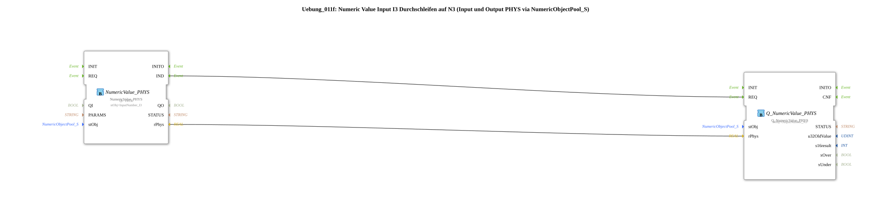

# Exercise_011f: Passing Through Numeric Value Input I3 to N3 (Input and Output PHYS via NumericObjectPool_S)

* * * * * * * * * *

## Introduction

This exercise demonstrates the direct pass-through of a numeric input value from the physical input I3 to the physical output N3.
The value is read without conversion or processing by a `NumericValue_PHYS` block and written to the output via a `Q_NumericValue_PHYS` block.
The use of a `NumericObjectPool_S` (DefaultPool_Numeric) establishes the connection to the specific input/output objects.

Example:

**I3 input -500.00 → rPhys = -500.0 → Q_NumericValue_PHYS(N3) → N3 displays -500.00**

## Function Blocks (FBs) Used

### Sub-block: Uebung_011f (SubAppType)

- **Type**: SubAppType (custom subapplication)
- **Internal FBs Used**:
- **NumericValue_PHYS** *(Type: `isobus::UT::io::NumericValue::NumericValue_PHYS`)*
- Parameters:
- `QI` = `TRUE`
- `stObj` = `InputNumber_I3` (from DefaultPool_Numeric)
- Event output: `IND`
- Data output: `rPhys` (real value)
- **Q_NumericValue_PHYS** *(Type: `isobus::UT::Q::Q_NumericValue_PHYS`)*
- Parameters:
- `stObj` = `OutputNumber_N3` (from DefaultPool_Numeric)
- Event input: `REQ`
- Data input: `rPhys` (real value)
- **Functionality**:

The function block `NumericValue_PHYS` reads the current physical value of input I3. As soon as a new value is available, this is signaled via the event `IND`, and the value is made available at the output `rPhys`.

This event is directly connected to the event input `REQ` of the function block `Q_NumericValue_PHYS`. Simultaneously, the data value `rPhys` is transferred to the corresponding data input of the output function block.

The function block `Q_NumericValue_PHYS` then writes the received value to the physical output object N3.

The entire subapplication thus functions as a transparent pass-through from I3 to N3.
...

## Program Flow and Connections

- **Event Connection**: `NumericValue_PHYS.IND` → `Q_NumericValue_PHYS.REQ`
- **Data Connection**: `NumericValue_PHYS.rPhys` → `Q_NumericValue_PHYS.rPhys`

The flow is purely event-driven:

1. The input block detects a change at I3 and fires `IND`.
2. The output block is triggered by `REQ` to take the current `rPhys` value and output it to N3.
3. Since no further processing steps take place, the value is transferred one-to-one.

**Learning Objectives**:

- Understanding the direct linking of physical inputs/outputs using `NumericValue_PHYS` and `Q_NumericValue_PHYS`.
- Learning about event-driven data passing (without additional logic).
- Using `NumericObjectPool_S` to configure I/O objects.

**Difficulty Level**: Beginner
**Prerequisites**: Basic knowledge of the 4diac IDE and the IEC 61499 model.

## Summary

Exercise **Exercise_011f** implements a simple pass-through of a numerical value from input I3 to output N3.

By combining `NumericValue_PHYS` (read) and `Q_NumericValue_PHYS` (write), a clear separation between I/O access and event control is achieved.

The subapplication is designed as a reusable building block and can be directly integrated into larger applications.

---

### 🌐 Related topic subpages on ms-muc-docs.de

- [🌐 Eclipse 4diac IDE & color reference on ms-muc-docs.de ](https://www.ms-muc-docs.de/iec-61499/eclipse-4diac/)
