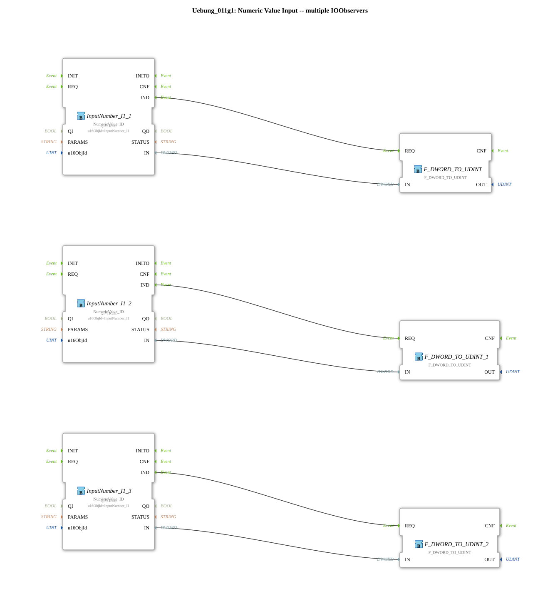

# Exercise_011g1: Numeric Value Input -- Multiple IOObservers

* * * * * * * * * *
## Introduction
This exercise demonstrates the parallel use of multiple `IOObserver` for a common numeric input value. Three instances of the function block `NumericValue_ID` monitor the same object identifier (`InputNumber_I1`). The returned `DWORD` values are each converted to the type `UDINT` using a conversion block. The exercise shows how multiple observers can be connected to a common data source without the values affecting each other.

## Function Blocks (FBs) Used

### Sub-Blocks: (none – the main block is a SubApp)

The SubApp consists directly of the following function blocks:

- **`NumericValue_ID`** (Type: `isobus::UT::io::NumericValue::NumericValue_ID`)
- **Parameterization**:
- `QI` = `TRUE` (Activation)
- `u16ObjId` = `InputNumber_I1` (Identifier of the numeric input)
- **Events**:
- Event output `IND` – signals that a new value is available
- **Data output**: `IN` (Type `DWORD`) – current value of the observed object instance
- **`F_DWORD_TO_UDINT`** (Type: `iec61131::conversion::F_DWORD_TO_UDINT`)
- **No further parameters**
- **Event input**: `REQ` – starts the conversion
- **Data input**: `IN` of type `DWORD`
- **Data output**: `OUT` of type `UDINT` (unsigned double integer)
- **Function**: Converts a 32-bit DWORD value to an unsigned 32-bit integer.

The network contains three identical pairs of these building blocks:

| Observer (NumericValue_ID) | Converter (F_DWORD_TO_UDINT) |

|----------------------------|-------------------------------|

| `InputNumber_I1_1` | `F_DWORD_TO_UDINT` |

| `InputNumber_I1_2` | `F_DWORD_TO_UDINT_1` |

| `InputNumber_I1_3` | `F_DWORD_TO_UDINT_2` |

## Program Flow and Connections

1. **Event Connections**:

Each observer (`IND`) is connected to the corresponding converter (`REQ`). As soon as a new value arrives from the ISOBUS gateway, the corresponding conversion process is triggered.

2. **Data Connections**:

The data output `IN` of each observer is directly connected to the data input `IN` of the corresponding converter. The three data paths are completely isolated from each other; each converter operates with the value of its assigned observer.

3. **Common Source**:

All three `NumericValue_ID` blocks obtain their data from the same ISOBUS object (`InputNumber_I1`). The observers can operate independently because each receives its own copy of the current value.

4. **Conversion**:

The outputs `OUT` of the three `F_DWORD_TO_UDINT` blocks represent the same numerical signal as `UDINT` – for different consumers within the application.

### Learning Objectives
- Understanding the parallel monitoring of a single ISOBUS variable with multiple `IOObserver` instances.
- Application of type conversions (`DWORD` → `UDINT`) in 4diac.
- Error prevention through separate signal paths (no data overlap).

## Difficulty Level

Easy – basic function blocks and simple wiring.

Basic knowledge of 4diac and working with ISOBUS data objects is required.

## Summary

Exercise `Uebung_011g1` demonstrates a pattern in which a single numeric input (`InputNumber_I1`) is read by three independent observer blocks. Each observer triggers its own conversion function block (`DWORD` → `UDINT`), resulting in three identical but isolated signal paths. This is useful when the value is needed in multiple places within the controller, and each place requires its own, uninterrupted copy of the data. The simple structure is ideal for introductory exercises in parallel data processing with 4diac.

---

### 🌐 Related topic subpages on ms-muc-docs.de
* [🌐 Eclipse 4diac IDE & Color Reference on ms-muc-docs.de](https://www.ms-muc-docs.de/iec-61499/eclipse-4diac/)

]
