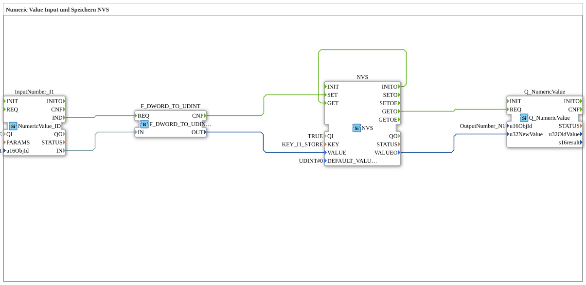

# Exercise_012: Numeric Value Input and Storage (NVS)

[(https://notebooklm.google.com/notebook/a6872e59-1dfc-4132-a118-aff1bc7bc944)
This article describes the logiBUS® exercise `Uebung_012`. It demonstrates how numeric values are not only displayed but also stored in the controller (NVS - Non-Volatile Storage) in a power-failure-proof manner.
## 🎧 Podcast

- [Amazon Pizza Rule to IKEA Effect: 12 Amazingly Simple Ideas Behind Huge Business Success ](https://podcasters.spotify.com/pod/show/ms-muc-lama/episodes/Amazon-Pizza-Regel-bis-IKEA-Effekt-12-verblffend-einfache-Ideen-hinter-riesigem-Geschftserfolg-e39kmmc)

----

## Objective of the Exercise

Learning persistent data storage. This demonstrates how a value entered at the terminal is stored in the controller's internal flash memory and automatically reloaded and displayed upon restart.

-----

## Description and Components

[cite_start]The subapplication `Uebung_012.SUB` combines input, storage, and display into a closed loop[cite: 1].

### Function Blocks (FBs)

- **`InputNumber_I1`**: Numeric input field on the terminal.
- **`NVS`**: Type `logiBUS::storage::esp32_nvs::NVS`. [cite_start]This block manages access to non-volatile memory. It stores values under a unique `KEY`[cite: 1].
- **`CbVtStatus`**: A terminal status block. [cite_start]It fires an event (`IND`) when the terminal restarts or the connection is re-established[cite: 1].
- **`Q_NumericValue`**: The numeric display on the terminal.

-----

## Functionality

The process covers three scenarios:

1. **Save**: When the user enters a value (`IND`), it is converted and permanently saved via `NVS.SET`.
2. **Load on Startup**: After booting, the memory chip sends a `INITO` event, which immediately triggers a read operation (`GET`). The stored value is loaded and sent to the display.
3. **Refresh on Connection**: If the terminal is briefly disconnected during operation, `CbVtStatus.IND` ensures that the current value is sent back to the terminal as soon as it is online again.

-----

## Application Example

**Configuration Parameters**: A farmer sets the working width of his implement once on the terminal. Thanks to NVS storage, he doesn't have to re-enter this value every morning when starting the machine; the controller "remembers" the last setting.
