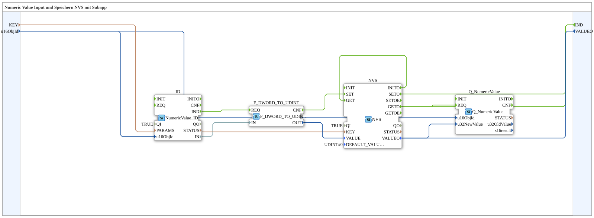

# Exercise_012a_sub: Numeric Value Input and Storage in NVS with Subapp

[(https://notebooklm.google.com/notebook/a6872e59-1dfc-4132-a118-aff1bc7bc944)
## Overview

[cite_start]This module serves as a universal interface for user input that is to be permanently stored in NVS (Non-Volatile Storage)[cite: 1].
It bundles the following functions:

1. **Input**: Reading a value from the terminal (`NumericValue_ID`).
2. **Save**: Automatically saving the value to flash memory under a selectable key (`KEY`).
3. **Load**: Automatically reading the value at system startup (`INITO -> GET`).
4. **Feedback**: Sends the (loaded or changed) value to the terminal display.

Additionally, the function block provides an input `REQ` to trigger an external display refresh (e.g., upon reconnecting to the terminal).

## 🛠️ Related Exercises

- [Exercise_012a](Uebung_012a.md)
