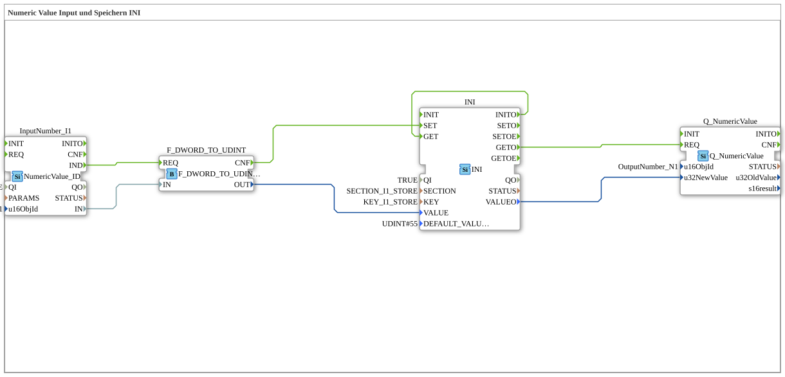

# Exercise_012b: Numeric Value Input and Storage in INI

This article describes the logiBUS® exercise `Uebung_012b`. It introduces an alternative method for storing data: the use of INI files.
----
## Objective of the Exercise

Using the `INI` block for structured data storage. Unlike simple NVS key-value storage, the INI format allows for structuring into sections and keys, which is more organized when dealing with large amounts of data.

-----

## Description and Components

[cite_start]The subapplication `Uebung_012b.SUB` uses an INI storage block[cite: 1].

### Function Blocks (FBs)

* **`INI`**: Type `eclipse4diac::storage::INI`. [cite_start]This block stores values in a file-based structure[cite: 1]. In addition to `KEY`, it requires `SECTION`.
* **Parameters**:
* `SECTION`: "SECTION_I1_STORE"
* `KEY`: "KEY_I1_STORE"
* `DEFAULT_VALUE`: 55 (loaded if no file exists).

-----

## Functionality

The logic otherwise corresponds to Exercise 012:

1. **Write**: `InputNumber -> REQ -> INI.SET`.
2. **Read**: `INITO -> INI.GET -> Q_NumericValue`.
3. **Refresh**: `CbVtStatus -> Q_NumericValue`.

INI files are particularly useful when parameters need to be read or edited externally (e.g., via a PC or web interface) because they are in a human-readable text format.

--

### 🌐 Related topic subpages on ms-muc-docs.de

* [🌐 Eclipse 4diac IDE & Color Reference on ms-muc-docs.de](https://www.ms-muc-docs.de/iec-61499/eclipse-4diac/)

]