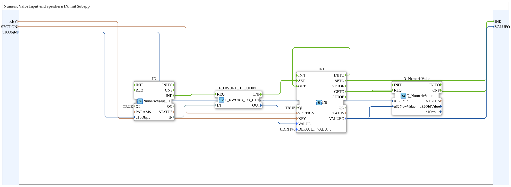

# Exercise_012c_sub: Numeric Value Input and Storage via INI with Subapp

* * * * * * * * * *
## Introduction
This exercise demonstrates how to read a numeric value via an object ID (e.g., from a CAN bus), convert it into a `UDINT`, and store it permanently using an INI storage function. The stored value can then be output via a `Q_NumericValue` block. The subapp provides the interfaces `KEY`, `SECTION`, `u16ObjId` (inputs) and `VALUEO` (output), as well as the event `IND`.
This component is typically used to persistently store configuration data or measured values and update them cyclically.

## Function Blocks (FBs) Used

### FB: ID (isobus::UT::io::NumericValue::NumericValue_ID)
- **Parameters**: `QI` = `TRUE`
- **Events**:
- Event Inputs: None visible
- Event Outputs: `IND` (triggered when a new value is received)
- **Data Inputs**: `u16ObjId` (from the SubApp input `u16ObjId`)
- **Data Outputs**: `IN` (the received numeric value as a DWORD)
- **Functionality**: Reads a numeric value from a specific object ID (e.g., from a ISOBUS network). Upon successful reception, the event `IND` is sent and the value is output to `IN`.

### FB: F_DWORD_TO_UDINT (iec61131::conversion::F_DWORD_TO_UDINT)
- **Parameters**: none
- **Events**:
- Event inputs: `REQ`
- Event outputs: `CNF`
- **Data inputs**: `IN` (DWORD)
- **Data outputs**: `OUT` (UDINT)
- **Functionality**: Converts a DWORD value to a UDINT value. The converted value is provided at output `OUT` after the conversion is complete.

```
### FB: INI (eclipse4diac::storage::INI)

- **Parameters**: `QI` = `TRUE`, `DEFAULT_VALUE` = `UDINT#0`
- **Events**:
- Event Inputs: `SET`, `GET`, `INI`
- Event Outputs: `SETO`, `GETO`, `INITO`
- **Data Inputs**: `KEY` (STRING), `SECTION` (STRING), `VALUE` (UDINT)
- **Data Outputs**: `VALUEO` (UDINT)
- **Functionality**: Stores a value under a key (`KEY`) in a section (`SECTION`) in an INI-like structure. When `SET` is triggered, the current value is stored and `VALUE` is triggered, and `SETO` is triggered. When `GET` is triggered, the stored value is read and output to `VALUEO` and `GETO` is sent. During initialization (event `INI`), the value is loaded from memory or `DEFAULT_VALUE` is used.

```
### FB: Q_NumericValue (isobus::UT::Q::Q_NumericValue)
- **Parameters**: None
- **Events**:
- Event inputs: `REQ`
- Event outputs: None visible in the subapp
- **Data inputs**: `u16ObjId` (UINT), `u32NewValue` (UDINT)
- **Data outputs**: None visible (used for internal processing / output to a higher-level system)
- **Functionality**: Receives a new value (`u32NewValue`) for a specific object ID (`u16ObjId`) and signals it, for example, to a higher-level controller or visualization system. Internal processing occurs upon receipt of the event `REQ`.

## Program Flow and Connections

The subapp operates in several steps, linked together via event and data connections.

1. **Read and Convert Value**

- The module `ID` waits for a new value for object ID `u16ObjId`. As soon as a value arrives, it sends the event `IND`.
- This event is forwarded to the conversion module `F_DWORD_TO_UDINT.REQ`.
- Simultaneously, the read DWORD value from `ID.IN` is passed to `F_DWORD_TO_UDINT.IN`.
- After successful conversion, `F_DWORD_TO_UDINT` sends the event `CNF`, and the converted UDINT value appears at `OUT`.

2. **Save Value**

- The event `F_DWORD_TO_UDINT.CNF` triggers the `INI.SET` input.
- The converted value is passed from `F_DWORD_TO_UDINT.OUT` to `INI.VALUE` via the data connection.
- The key (`KEY`) and section (`SECTION`) are passed directly from the SubApp inputs to the INI block.

``` - After saving, `INI` sends the event `SETO`, which is forwarded to the subapp output `IND` (there, it appears as the visible output of the subapp).

3. **Output/Update Saved Value**

- When the subapp is initialized (implicitly or via an external initialization event), `INI.INITO` is triggered and directly connected to `INI.GET` (see event connection `INI.INITO -> INI.GET`). This reads the last saved value.
- The read value appears at `INI.VALUEO`.
- The event `GETO` is simultaneously passed to two locations:
- To the function block `Q_NumericValue.REQ`, which takes the value (`INI.VALUEO` → `Q_NumericValue.u32NewValue`).
- To the subapp output `IND` (invisible connection), so that the parent application is informed of the update.
- The object ID for `Q_NumericValue` comes from the subapp input `u16ObjId`.

4. **Subapp Output**

- The stored value `VALUEO` is passed through in parallel to the subapp output `VALUEO`.

The following diagram (schematic) shows the essential connections:

u16ObjId ──┬──> ID.u16ObjId
└──> Q_NumericValue.u16ObjId

ID.IND ───> F_DWORD_TO_UDINT.REQ
ID.IN  ───> F_DWORD_TO_UDINT.IN
F_DWORD_TO_UDINT.CNF ───> INI.SET
F_DWORD_TO_UDINT.OUT ───> INI.VALUE
KEY ───> INI.KEY
SECTION ───> INI.SECTION
INI.SETO ───> IND (SubApp Ausgang)
INI.VALUEO ───> Q_NumericValue.u32NewValue
INI.VALUEO ───> VALUEO (SubApp Ausgang)
INI.GETO ───> Q_NumericValue.REQ
INI.GETO ───> IND (SubApp Ausgang)
INI.INITO ───> INI.GET (intern)
## Summary

In this exercise, a sub-application was implemented that reads a numeric value via an object ID, converts it to a `UDINT`, stores it in an INI-like memory structure, and then outputs the stored value. The following concepts were used:

- **NumericValue_ID** for reading a value from a fieldbus or network.
- **F_DWORD_TO_UDINT** for data type conversion.
- **INI** block for persistent storage using a key/section.
- **Q_NumericValue** for further processing of the stored value.

The sub-application demonstrates the typical procedure for cyclical data acquisition and storage in automation technology. It can serve as a basis for more complex applications such as storing parameters or logging measured values.

---

### 🌐 Related topic subpages on ms-muc-docs.de
* [🌐 Eclipse 4diac IDE & Color Reference on ms-muc-docs.de](https://www.ms-muc-docs.de/iec-61499/eclipse-4diac/)

]
