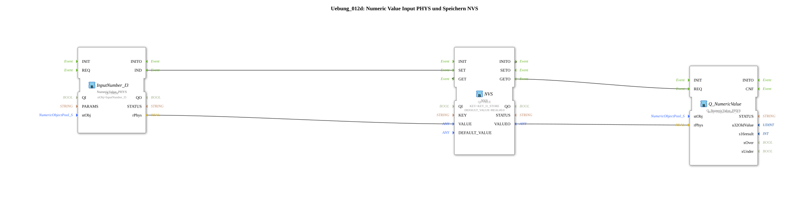

# Exercise_012d: Numeric Value Input PHYS and Storage NVS

* * * * * * * * * *
## Introduction
This exercise demonstrates the acquisition of a numeric value (physical value) via an input block, the storage of the value in non-volatile memory (NVS), and the retrieval and provision of the stored value via an output block. The goal is to understand the process of data acquisition, persistent storage, and return.
## Function Blocks Used

This exercise uses three function blocks that are interconnected within the subapplication:

1. **InputNumber_I3** – Type: `isobus::UT::io::NumericValue::NumericValue_PHYS`

- Parameters:
- `QI` = `TRUE`
- `stObj` = `InputNumber_I3`
- Function: Provides the physical input of a numeric value. The value is output via the data output `rPhys` as soon as an event occurs at the input `IND`.

2. **NVS** – Type: `logiBUS::storage::esp32_nvs::NVS`

- Parameters:
- `QI` = `TRUE`
- `KEY` = `KEY_I1_STORE` (imported from `Uebungen::const::NVS::NVS_Keys`)
- `DEFAULT_VALUE` = `REAL#0.0`
- Function: Non-volatile memory module. It stores a value under a predefined key (`KEY`) and can read it back as needed. The events `SET` and `GET` control the saving and reading operations, respectively. The outputs `VALUEO` provide the stored value.

3. **Q_NumericValue** – Type: `isobus::UT::Q::Q_NumericValue_PHYS`

- Parameters:
- `stObj` = `OutputNumber_N3`
- Function: Provides a numeric value as a physical output. The value is received via the data input `rPhys` and output upon an event at the input `REQ`.

### Sub-Blocks

The exercise itself is defined as a SubAppType and contains no further sub-blocks. The three FBs mentioned above are directly connected in the network.

## Program Flow and Connections

The flow is as follows:

1. **Input and Storage**

- When a new physical value is present at `InputNumber_I3`, it generates an event at output `IND`.
- This event is forwarded via an event connection to input `SET` of the NVS module.
- Simultaneously, the data value from `InputNumber_I3.rPhys` is transferred via a data connection to the NVS data input `VALUE`.
- The NVS stores the value under the key `KEY_I1_STORE` in non-volatile memory.

` `\` ` ... 2. **Initialization and Data Reading**

- After starting (or after initialization), the NVS block generates an event at output `INITO`.
- This event is fed back to input `GET` of the NVS via an event connection (self-triggering).
- The NVS then reads the stored value and places it at data output `VALUEO`.
- Simultaneously, an event is generated at output `GETO`.

3. **Output**

- The event `NVS.GETO` is forwarded to input `REQ` of the output block `Q_NumericValue`.
- The data value `NVS.VALUEO` is transferred to input `Q_NumericValue.rPhys` via a data connection.
- `Q_NumericValue` then makes the value available at physical output `OutputNumber_N3`.

In summary: Every incoming value is immediately stored, and the last stored value is automatically output at system startup. This exercise is suitable for beginners who want to learn about the interaction of input/output modules with non-volatile memory.

## Summary

The exercise `Uebung_012d` implements a robust storage and recovery function for a physical numerical value. By coupling an input block (`NumericValue_PHYS`) with an NVS block and an output block (`Q_NumericValue_PHYS`), it is ensured that the last value remains available even after a restart. The process is simple and easy to understand: capture value → save → initial read → output.
