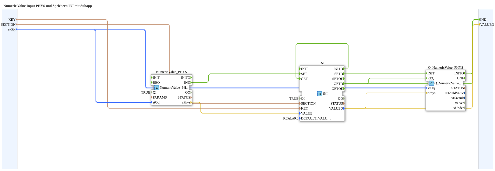

# Exercise_012e_sub: Numeric Value Input PHYS and Saving to INI with Subapp

* * * * * * * * * *
## Introduction
This exercise demonstrates how to read a physical numeric value (Numeric Value) using a function block, save it to an INI file, and process it using a quality block (Q). All functionality is encapsulated in a SubApp (SubAppType `Uebung_012e_sub`). The SubApp has the inputs `KEY`, `SECTION`, and `stObj`, as well as the output `VALUEO`. A successful completion event, `IND`, signals the completion of the process.

## Function Blocks Used (FBs)

The subapp contains three predefined function blocks:

- **NumeriValue_PHYS** (`isobus::UT::io::NumericValue::NumericValue_PHYS`)
- Parameter: `QI = TRUE` (enabled)
- Task: Reads a physical numeric value based on the object pool (`stObj`) and outputs the result as `rPhys` (REAL).
- **INI** (`eclipse4diac::storage::INI`)
- Parameters: `QI = TRUE`, `DEFAULT_VALUE = REAL#0.0`
- Task: Saves or retrieves values from an INI file. The write operation is triggered by the event `SET`, and the read operation by `GET`. Upon initialization (`INIT`), the existing value is automatically read from the INI file.
- **Q_NumericValue_PHYS** (`isobus::UT::Q::Q_NumericValue_PHYS`)
- Parameters: No special parameters
- Task: Performs a quality assessment of the numeric value (e.g., checking for validity or range). It receives the input value via `rPhys` and configures it via `stObj`.

## Program Flow and Connections

### Event Connections

1. **Trigger Read Value**

When the function block `NumeriValue_PHYS` provides a new physical value, it sends the event `IND`. This is linked to the `SET` event of the `INI` block. This saves the current value (`rPhys`) in the INI file under the specified `KEY` and `SECTION`.

2. **Feedback After Saving**

After saving, `INI` signals with `SETO` that the process is complete. This event is directly forwarded to the output `IND` of the SubApp (with the property `Visible=false`, i.e., hidden in the diagram).

3. **Reading and Quality Checking the Value from the INI**

After saving (or after initialization), the event `GETO` of the `INI` block is triggered. It is linked to the `REQ` event of the `Q_NumericValue_PHYS` block. This reads the stored value from the INI and performs a quality check.

Additionally, `GETO` is also forwarded to the output `IND`, so the SubApp outputs a signal even after the read operation.

``` 4. **Initialization**

The `INI` block also has its own `INIT` event, which is directly linked to the `GET` event. This ensures that when the subapp starts, the value stored in the INI file is automatically read and then processed through the `GETO` flow of the quality block.

### Data Connections
- The physical value (`rPhys`) of `NumeriValue_PHYS` is passed to the data input `VALUE` of the `INI` block.

### Data Connections
- The physical value (`rPhys`) of `NumeriValue_PHYS` is passed to the data input `VALUE` of the `INI` block.

``` - The object pool structure object (`stObj`) is passed from the SubApp interface to `NumeriValue_PHYS` and `Q_NumericValue_PHYS`.

- The SubApp inputs `KEY` and `SECTION` are directly connected to the corresponding inputs of the `INI` block (both hidden in the diagram).

``` - The output `VALUEO` of the subapp receives its value from the quality-checked result of the `Q_NumericValue_PHYS` block (routed via `VALUEO` from `INI` -> `rPhys` to `Q_NumericValue_PHYS`).

```
## Summary

The subapp `Uebung_012e_sub` demonstrates the complete process:

- **Reading** a physical numeric value via `NumeriValue_PHYS`,
- **Saving** this value to an INI file using `INI`,
- **Reading back** and **Quality check** of the saved value using `Q_NumericValue_PHYS`.

It is designed as a reusable component that is configured via the parameters `KEY`, `SECTION`, and `stObj`. It outputs the processed value at `VALUEO` and acknowledges the process via the event `IND`.

It is designed as a reusable component that is configured via the parameters `KEY`, `SECTION`, and `stObj`. ---

### 🌐 Related topic subpages on ms-muc-docs.de
* [🌐 Eclipse 4diac IDE & Color Reference on ms-muc-docs.de](https://www.ms-muc-docs.de/iec-61499/eclipse-4diac/)

]
